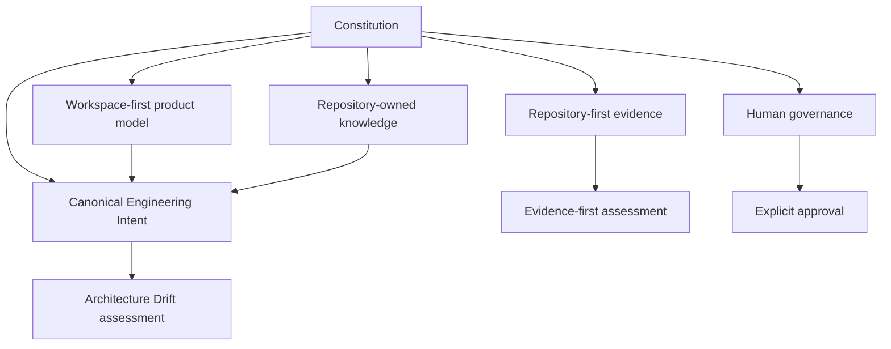
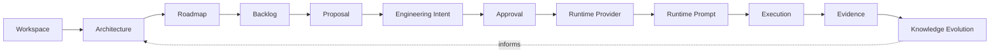
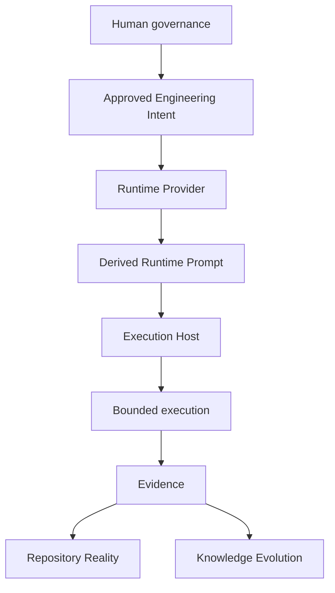
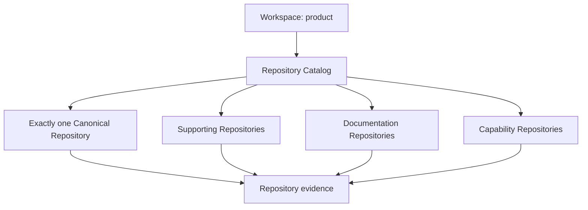
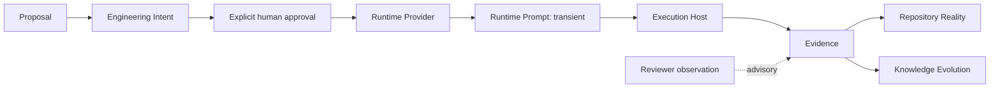
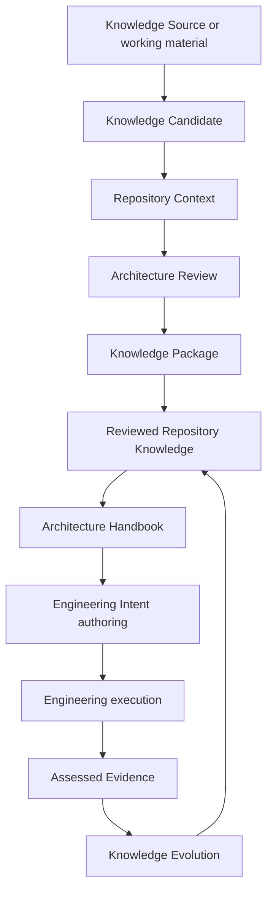
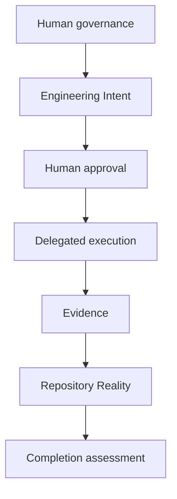
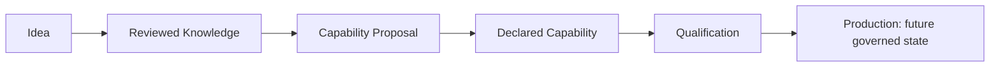
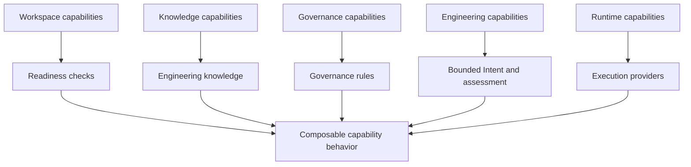
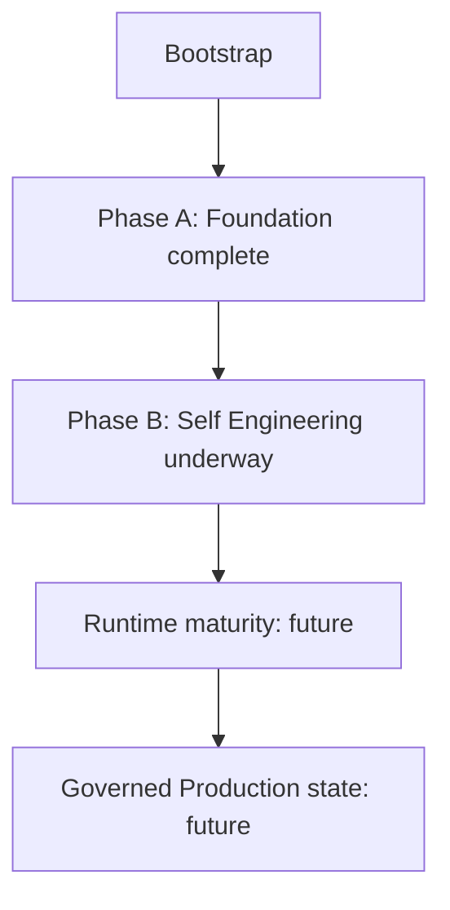

# Forge Founding Architecture Handbook

**Edition:** First edition

**Status:** Canonical architectural reference

**Basis:** Reconciled repository knowledge

## How to use this handbook

This handbook is the integrated architectural expression of Forge's completed
Bootstrap Knowledge Package. It explains the relationships among the existing
constitutional, product, engineering, knowledge, governance, capability, and
roadmap records. It does not replace their authority: where this narrative
conflicts with a canonical source, the source governs.

The handbook is deliberately architectural rather than operational. It records
what Forge is, why its boundaries exist, and how its established concepts fit
together. It does not introduce a Runtime Provider, execution system, approval
workflow, cloud service, Studio, marketplace, or any other unimplemented
capability. Future Engineering Intents should use this handbook as their
primary architectural orientation, then consult the linked canonical records
for the applicable authority.

### Authority and source map

| Subject | Canonical source | Handbook role |
| --- | --- | --- |
| Permanent principles | [Constitution](../../knowledge/bootstrap/01_CONSTITUTION.md) | Part I interprets their combined effect. |
| Product direction | [Vision](../../knowledge/bootstrap/02_VISION.md) | Part II explains the outcome those principles serve. |
| Conceptual structure | [Core Architecture](../../knowledge/bootstrap/03_ARCHITECTURE.md) | Part III integrates layers and boundaries. |
| Product and repository ownership | [Workspace & Repository Model](../../knowledge/bootstrap/04_WORKSPACE_REPOSITORY.md) | Part IV explains topology without making it operational. |
| Bounded engineering | [Engineering Model](../../knowledge/bootstrap/05_ENGINEERING_MODEL.md) | Part V follows meaning from direction to evidence. |
| Durable knowledge | [Knowledge Model](../../knowledge/bootstrap/06_KNOWLEDGE_MODEL.md) | Part VI distinguishes sources, review, and authority. |
| Human authority and assessment | [Governance Model](../../knowledge/bootstrap/07_GOVERNANCE.md) | Part VII connects readiness, approval, and completion. |
| Platform evolution | [Capability Catalogue](../../knowledge/bootstrap/09_CAPABILITIES.md) | Part VIII frames modular growth. |
| Founding provenance | [Bootstrap History](../../knowledge/bootstrap/08_BOOTSTRAP_HISTORY.md) | Part IX preserves context without elevating it. |
| Strategic direction | [Roadmap](../../knowledge/bootstrap/10_ROADMAP.md) | Part X records direction without authorizing work. |
| Vocabulary and uncertainty | [Glossary](../../knowledge/bootstrap/11_GLOSSARY.md), [Open Questions](../../knowledge/bootstrap/12_OPEN_QUESTIONS.md) | Appendices preserve precise language and deferred decisions. |

The [Bootstrap Knowledge Reconciliation Report](../reports/bootstrap-knowledge-reconciliation-001.md)
established that this edition can be authored solely from repository knowledge.

---

# Part I — Constitution

## 1. The constitutional shape of Forge

Forge is built to engineer software products under human governance. Its
constitution makes that aim durable by fixing the sources of truth and the
boundaries between product meaning, execution, and assessment. The resulting
architecture is neither prompt-centred nor host-centred: repository evidence is
authoritative for repository reality, the Workspace is the product boundary,
Engineering Intent is the canonical statement of bounded work, and humans
retain authority to approve progression.

The twelve constitutional articles operate as one system. Repository-first
engineering and evidence-first assessment make results observable. The
Workspace-first model keeps product identity distinct from a repository.
Engineering Intent and runtime independence prevent a provider-specific prompt
or temporary host from becoming product knowledge. Human governance makes all
automation bounded by explicit authority. Capability-first evolution and
knowledge ownership preserve an accountable path for change. Bootstrap,
architecture-drift, readiness, and constitutional-change principles protect
that system as Forge evolves.

## 2. Durable invariants

The following invariants are architectural guardrails, not optional guidance.

- Repository evidence outweighs reports, observations, conversations, prompts,
  and assumptions when assessing repository reality.
- A Workspace models a product; a Repository models an engineering asset. A
  Workspace may have many repositories but exactly one canonical catalog entry.
- Engineering Intent records the model-independent objective, rationale,
  scope, constraints, validation, deliverables, and expected evidence of one
  bounded increment. A Runtime Prompt does not.
- Forge owns engineering knowledge; Runtime Providers translate approved
  Intent, while Execution Hosts perform work. Neither owns the meaning of the
  work or its completion decision.
- AI can analyse, plan, propose, and execute only within explicit human
  authority. Generated artifacts and lifecycle labels do not approve work.
- Completion is evidence-backed. Implementation success or an assertion of
  success alone is insufficient.
- New engineering behavior is introduced through explicit, versioned
  Capabilities, not by treating documented concepts as delivered behavior.
- Repository-held knowledge is durable; conversations and bootstrap inputs are
  not permanent architectural authority.

The remaining constitutional protections make this model durable over time.
Engineering Platform 1.5 is only the temporary Bootstrap Execution Host;
Genesis is an execution profile, not a permanent host architecture.
Architecture Drift compares canonical Intent with Repository Reality rather
than prompt history. Workspace Readiness assesses prerequisites before a
declared execution profile, while Phase Completion assesses evidence after a
phase. Constitutional change is exceptional: it requires explicit human
governance, an architecture decision, repository evidence, and reconciliation
of affected records; routine work cannot change the Constitution implicitly.

---

# Part II — Vision

## 3. Why Forge exists

Forge exists because code generation is not, by itself, engineering. A product
also needs enduring product context, architecture, accountable approvals,
bounded work, observable execution, and evidence that the intended outcome was
actually achieved. Forge is therefore an AI-native engineering platform whose
purpose is to engineer products under human governance.

That purpose explains its scope: Workspace management, architecture,
capabilities, knowledge, engineering planning and execution, governance, and
runtime abstraction form one engineering model. It also explains its limits.
Forge is not a coding assistant, prompt manager, IDE replacement, Git
replacement, deployment platform, or CI server. Those systems may be used by
an Execution Host, but their use does not transfer their ownership to Forge.

## 4. Direction without self-authorization

Forge's intended lifecycle turns durable product understanding into assessed
learning. Each stage has a different responsibility so that no later stage can
silently replace the authority of an earlier one.

Vision gives stable direction; Architecture gives structure; Roadmap and
Backlog make opportunities visible; a Proposal scopes and justifies a candidate
increment; Intent makes the bounded work canonical; Approval authorizes
progression; a Runtime Provider and Prompt make it executable in a chosen
context; Evidence assesses the result; Knowledge Evolution returns assessed
learning to future direction. The sequence is conceptual, not a currently
implemented runtime workflow.

Bootstrap intentionally began by engineering Forge through bounded local work.
This revealed the important distinctions captured here, but bootstrap history
informs the product rather than authorizing future work. Long-term directions
such as Self Engineering, Knowledge Distillation, Runtime abstraction,
Capability Marketplace, and multi-user governance remain directions, not
implemented behavior or approved commitments.

---

# Part III — Core Architecture

## 5. Layers and their relationships

Forge separates product meaning, candidate work, bounded work, authorization,
translation, execution, evidence, and learning. Its primary layers are:

| Layer | Architectural responsibility | It must not do |
| --- | --- | --- |
| Workspace | Own product identity and operating context. | Become a repository or operate repositories. |
| Architecture | State enduring structure, boundaries, and invariants. | Become implementation or a runtime instruction. |
| Roadmap and Backlog | Frame strategic direction and candidate work. | Authorize execution. |
| Proposal | Scope and justify a candidate increment. | Become an Intent, approval, or execution. |
| Engineering Intent | Preserve canonical, model-independent bounded work. | Grant approval or execute itself. |
| Approval | Apply human authority to progression. | Change Intent content or invoke a provider. |
| Runtime Provider | Translate approved Intent into a provider-specific prompt. | Own, reinterpret, or approve the Intent. |
| Execution Host | Perform bounded work and yield observable outcomes. | Own Forge knowledge, governance, or completion. |
| Evidence and Knowledge Evolution | Assess outcomes and inform reviewed future knowledge. | Silently rewrite architecture or expand scope. |

This separation creates a stable seam between Forge-owned meaning and
replaceable execution infrastructure. A provider may change prompt syntax, and
a host may change its tools, without changing what the product means or what a
particular Intent declares.

## 6. Execution architecture

The runtime boundary is intentionally narrow. Forge owns knowledge and Intent;
a Runtime Provider derives a temporary Runtime Prompt; an Execution Host uses
that prompt to perform bounded work; observable results contribute Evidence;
repository evidence establishes Repository Reality where relevant. The host can
use Git, CI, deployment systems, or adjacent tools without making Forge their
replacement.

During bootstrap, Engineering Platform 1.5 supplies the temporary Bootstrap
Execution Host. Forge is independent from it: it is neither a rename of that
platform nor permanently coupled to it. A future Forge Runtime or independent
Execution Host remains future work and must preserve this ownership boundary.

## 7. Boundaries that preserve the architecture

Forge orchestrates relationships among knowledge, intent, governance, and
evidence. It does not own version control, deployment, CI, an IDE, or code
generation. A repository remains the source of its implementation truth; a
Workspace remains the product boundary; a Knowledge Source remains a
versioned, read-only external evidence provider; a Runtime Provider does not
own repositories or canonical meaning; and an Execution Host does not own
Workspaces, Intent, or Forge knowledge.

These non-ownership rules are what allow a local-first foundation to evolve
without confusing a useful tool with the product's architectural authority.

---

# Part IV — Workspace & Repository

## 8. The Workspace is the product boundary

A Workspace represents a software product. It owns product identity,
architecture, roadmap, engineering knowledge, capabilities, governance, and
the context in which engineering history is understood. It selects an
Engineering Mode and a Governance Profile, neither of which automatically
authorizes work. The Workspace does not discover, clone, inspect, mutate, or
otherwise operate repositories.

A Repository is a version-controlled engineering asset belonging to that
Workspace. It contains implementation and supplies observable repository
evidence. It is not the product merely because it is cataloged or canonical.

## 9. Repository topology

The Workspace-owned Repository Catalog maps independent repository identities
to roles. It is declarative and mutation-free. It contains exactly one
Canonical Repository and may contain Supporting, Documentation, and Capability
repositories. A repository has one catalog role; role is not part of its
identity. `Knowledge Repository` describes a knowledge-holding use of a
repository, not a fifth catalog role.

Canonical means a clear engineering centre of gravity, not exclusive ownership
of implementation, architecture, product identity, or external systems. This
model permits clients, firmware, documentation, capabilities, and
infrastructure to remain distinct engineering boundaries while belonging to
one product understanding.

## 10. Workspace operating context

The established execution modes are `prototype`, `managed`, and `production`.
Bootstrap activates `prototype` only; modes express context, not authority.
The established Governance Profile catalog is `solo`, `two_person`, `team`,
and `enterprise`, with `solo` active in bootstrap. Workspace Readiness is the
evidence-based assessment that declared prerequisites for a chosen execution
profile are satisfied. It is not Phase Completion and does not execute work.

Future Workspace Adoption, Repository Extraction, Workspace Templates, and
Workspace Overlays are conceptual boundaries only. They do not currently
inspect or mutate repositories, migrate a Workspace, or add catalog roles.

---

# Part V — Engineering Model

## 11. From direction to bounded work

The engineering model gives each stage in the lifecycle a stable role. Vision
sets long-lived purpose. Architecture constrains product structure. Roadmap
expresses capability-oriented strategic movement. Backlog records opportunities
without authorizing them. Proposal makes a candidate increment reviewable by
stating rationale, scope, dependencies, risk, and motivating evidence.

Engineering Intent is the critical architectural bridge. It is formed from a
Proposal within Vision and Architecture constraints and records one bounded
objective in a model-independent form. It remains canonical when providers,
prompts, hosts, or implementation details change. Approval is separate human
authority: it authorizes progression but does not modify the Intent or select a
runtime.

## 12. Intent, prompt, execution, and evidence

The previous conceptual shortcut—Proposal directly to Prompt to Execution—is
rejected because prompt wording varies by provider and host. A Runtime Prompt
is disposable provider-specific instruction, never canonical engineering
knowledge, evidence, approval, or the basis of Architecture Drift. Execution
does not approve itself, redefine Intent, or make a completion claim
authoritative. Evidence provides the observable basis for assessing the
declared result; reviewer observations remain advisory when they conflict with
repository evidence.

## 13. The closed engineering loop

Evidence may inform Knowledge Evolution, which in turn informs later Vision,
Architecture, Roadmap, Backlog, Proposal, and Intent authoring. It does not
retroactively alter an approved Intent, create unbounded scope, or automatically
rewrite governing knowledge. This is how Forge learns from engineering without
allowing transient execution material to become architecture.

---

# Part VI — Knowledge Model

## 14. Repository-owned knowledge

Forge treats repository-held knowledge as durable engineering knowledge because
it is versioned, reviewable, linkable, and available after a conversation,
provider, prompt, or execution context disappears. The Workspace owns this
product knowledge; repositories hold its versioned expression and evidence.
Conversations, working material, runtime prompts, generated output, and
temporary execution context may be useful inputs, but cannot establish lasting
architectural authority by themselves.

Knowledge Sources are distinct, external, versioned, read-only evidence
providers. During bootstrap, the AI Platform Engineering Knowledge Base,
DJConnect, and Technical Debt Engine supplied different reference patterns;
they did not transfer their product architecture to Forge. Bootstrap Knowledge
Packages preserve discoveries from temporary work, but after reconciliation the
repository—not a source package or conversation—is authoritative.

## 15. Knowledge lifecycle

Knowledge Distillation is the future conceptual boundary that identifies
candidate decisions, capability ideas, glossary additions, roadmap changes,
and Intent candidates while retaining provenance and uncertainty. Knowledge
Reconciliation is the future conceptual boundary that compares each candidate
with Repository Context, subjects the delta to Architecture Review, and
captures reviewed knowledge. Neither automatically writes a repository,
approves work, or transfers authority from a conversation to architecture.

Repository Context is the comparison baseline: it prevents duplicate,
superseded, contradictory, or irrelevant material from becoming product truth.
The relevant output is a reviewed delta, not simply a statement that appeared
in a source. An Architecture Handbook is the coherent expression derived from
reviewed repository knowledge and informs Intent authoring; it does not replace
the Constitution or become a direct, automatic target of execution output.

## 16. Vocabulary as architecture

The Glossary is part of the knowledge model because shared terms prevent a
provider's conversational wording from redefining Forge concepts. Distillation
may identify a term, but Reconciliation and review must establish it in
repository knowledge. The glossary appendix in this handbook preserves the
current vocabulary and labels future and unresolved terms as such.

---

# Part VII — Governance

## 17. Human authority in an AI-native platform

Human governance is the architectural control plane. Humans define Vision,
Architecture, Constitution, Governance, and Approvals. Forge and AI may
analyse, plan, propose, and execute within explicit delegated authority,
declared scope, constraints, validation, and expected evidence. A delegation
is bounded: it cannot alter the enduring records, broaden itself, or turn a
runtime's availability into approval.

Governance Profiles state the human-authority context. Execution Modes state
the execution context. Neither is an approval mechanism, identity system,
RBAC model, queue, or workflow. The selected profile informs expected human
review and approval, but does not itself grant a Runtime Provider authority.

## 18. Readiness, evidence, and completion

Governance separates two assessments that are often conflated:

| Assessment | Question | Boundary |
| --- | --- | --- |
| Workspace Readiness | Is the Workspace prepared for a declared execution profile? | Before execution; does not execute, approve, or complete a phase. |
| Phase Completion | Do declared phase criteria have reproducible evidence? | After relevant work; does not grant approval or mutate Intent. |

Repository Truth is established from observable repository evidence and
outranks reviewer observations, reports, conversations, and runtime claims for
repository reality. Engineering reports can communicate Initial Repository
Assessment, Engineering Outcome, Reviewer Findings, Repository Truth, and
Management Summary, but no report is itself the evidence or authority it
describes.

Bootstrap governance preserves the same rule: Engineering Platform 1.5 was a
temporary Bootstrap Execution Host and never an approval source, a permanent
Forge dependency, or owner of repository truth. Future approval, qualification,
Architecture Stewardship, and multi-user governance mechanisms require
separate governed capabilities.

---

# Part VIII — Capability Framework

## 19. Capability-first evolution

A Capability is a bounded, reusable unit through which Forge may add
engineering behavior. It has a stable identity, versioned declaration,
responsibility, non-goals, relationship to the owning Workspace, and explicit
dependencies. It is intended to be discoverable, composable, and independently
evolvable. None of those properties implies installation, execution, approval,
compatibility, or production trust. Bootstrap's present schema boundary is
`declared`.

This lifecycle distinguishes an idea from durable knowledge, a bounded
proposal, a declared responsibility, assessment, and operating trust. No stage
transition occurs merely because a document, prompt, report, or successful
runtime output names it.

## 20. Capability relationships

The catalogue groups architectural responsibility across Workspace, Knowledge,
Governance, Engineering, Runtime, Documentation, Architecture, Platform,
Readiness, Identity, and Execution. Categories locate responsibility; they do
not give a capability authority or make an implemented module.

Established conceptual boundaries include Workspace Readiness, Workspace
Adoption, Repository Extraction, Templates, Overlays; Knowledge Distillation,
Reconciliation, Import, Evolution, Architecture Steward, and Bootstrap
Knowledge Import; Planning, Proposal, Engineering Intent, Approval, Repair
Planning, Drift Assessment, Phase Completion, and future Mission Runtime;
Runtime Provider, Execution Host, Prompt Translation, Execution,
Observability, and Qualification; plus Product Identity, Rebranding,
Architecture Handbook, Roadmap Management, and Capability Marketplace.

The catalogue does not claim that these are all implemented. Each prospective
realization needs separately bounded Intent, governance, validation, evidence,
and—where relevant—Qualification. Explicit dependencies preserve modularity:
a Capability can contribute readiness checks, knowledge, governance rules, or
execution-provider behavior without collapsing into a single platform runtime.

---

# Part IX — Bootstrap History

## 21. Founding context and completion boundary

Forge was founded in a local bootstrap environment because it needed a working
execution context before it could own a future runtime. Engineering Platform
1.5 supplied that temporary Bootstrap Execution Host for bounded Genesis
transactions. Forge remains an independent repository and product model.

Bootstrap established the Workspace versus Repository distinction, repository
truth and evidence, canonical Engineering Intent versus derived Runtime Prompt,
runtime independence, human governance, capability-first evolution, knowledge
ownership, Workspace Readiness, Architecture Drift, and the separate roles of
Phase Completion and qualification. It also captured this knowledge in the
repository so original engineering conversations are no longer an architectural
dependency.

Bootstrap is complete as a founding period. Its reports and transactions are
provenance, not current authority. They do not redefine the Constitution,
select current work, prove an unimplemented capability exists, or create a
runtime commitment. The completed Bootstrap Knowledge Package and its
reconciliation report are the repository-held bridge from founding work to this
handbook.

---

# Part X — Roadmap

## 22. Strategic evolution, not an execution plan

The roadmap records strategic direction without selecting backlog work,
authorizing implementation, or treating a named possibility as a commitment.
It is capability-driven: a Roadmap may inform an Intent, but a separately
governed Proposal and Approval must bound work before implementation.

Phase A established the local, deterministic Foundation: schemas, immutable
models, loaders, registries, declarations, and typed evidence references. It
does not include intent persistence, Runtime Providers, Mission Runtime,
repository operation, execution, Studio, cloud, or multi-user behavior.

Phase B, Self Engineering, is underway. Its delivered Increment 1.0 is the
evidence-only Phase Completion Framework; it assesses declared criteria from
reproducible evidence without orchestrating work, operating repositories, or
granting authority. The strategic target is to mature separately governed
Capabilities for durable Intent, knowledge reconciliation, runtime-specific
representations derived from Intent, and evidence assessment, while retaining
Prompt Artifact compatibility until Runtime Providers are separately governed.

## 23. Directional boundaries

The future knowledge direction is reviewed Repository Knowledge to Architecture
Handbook to Engineering Intent to Engineering, with Evidence contributing
through Knowledge Evolution. The runtime direction is Bootstrap Host to a
future Forge Runtime to independent Execution Hosts, always preserving
Intent, knowledge, governance, and completion boundaries. Studio, renderer,
SaaS, cloud, marketplace, API, Mission Runtime, and multi-user mechanisms are
deferred; no implementation technology, storage model, or execution contract
has been selected.

Self Hosting is not established as a Forge phase, capability, runtime
commitment, or architectural definition. Production is a future governed
operating state reached only after separate authorization and qualification.
All future directions depend on the Foundation, repository-first knowledge,
explicit capabilities, human governance, qualification evidence, and a
separately authorized Engineering Intent.

---

# Appendices

## Appendix A — Glossary

| Term | Meaning in this handbook |
| --- | --- |
| Architecture Drift | Assessed difference between Engineering Intent and Repository Reality. |
| Architecture Handbook | Maintained architectural expression derived from reconciled Repository Knowledge. |
| Capability | Explicit, versioned, bounded unit through which Forge may add engineering behavior. |
| Capability Qualification | Capability-specific assessment of declared criteria and evidence; not self-approval. |
| Canonical Repository | Exactly one primary product source-of-truth entry in a Repository Catalog. |
| Engineering Intent | Canonical, model-independent record of one bounded engineering objective and its evidence expectations. |
| Execution Host | Replaceable environment that performs work without owning knowledge, governance, or completion. |
| Execution Mode | Declared manner of approaching execution; context, not authority. |
| Evidence | Reproducible, assessable references used to evaluate declared outcomes. |
| Genesis | Bootstrap profile for bounded local transactions on the temporary host. |
| Governance Profile | Workspace-selected declaration of human authority, review, and approval expectations. |
| Knowledge Candidate | Potential reusable knowledge requiring comparison and review before repository adoption. |
| Knowledge Distillation | Future boundary that identifies candidates from working material while retaining provenance and uncertainty. |
| Knowledge Package | Bounded bootstrap or domain knowledge input; not the final canonical repository record. |
| Knowledge Reconciliation | Future boundary that compares candidates with Repository Context and architectural constraints. |
| Knowledge Source | Versioned, read-only external evidence provider. |
| Repository Catalog | Workspace-owned declarative mapping of repository identities to roles. |
| Repository Reality / Truth | Observable repository state established by authoritative repository evidence. |
| Runtime Prompt | Temporary, provider-specific execution artifact derived from Intent. |
| Runtime Provider | Replaceable translation boundary from approved Intent to Runtime Prompt. |
| Workspace | Highest product boundary, owning identity, architecture, roadmap, capabilities, governance, and engineering context. |
| Workspace Readiness | Evidence-based assessment of prerequisites for an execution profile, distinct from Phase Completion. |

The full canonical definitions, including **Architecture Steward**, **Managed**,
**Mission Runtime**, **Renderer Host**, and **Self Hosting**, are maintained in
the [Glossary](../../knowledge/bootstrap/11_GLOSSARY.md). Terms identified there
as future or unresolved remain future or unresolved here.

## Appendix B — Architecture diagrams at a glance

The handbook's diagrams express complementary views of one architecture:

1. Constitution connects invariants to evidence, Workspaces, Intent,
   governance, and knowledge.
2. Lifecycle diagrams show how durable direction becomes bounded execution and
   assessed learning.
3. Repository topology distinguishes the product boundary from implementation
   assets.
4. Execution architecture isolates Forge-owned meaning from a replaceable
   provider and host.
5. Knowledge lifecycle moves reviewed knowledge into the handbook and future
   Intent authoring without automatic authority transfer.
6. Governance distinguishes authorization, readiness, and evidence-backed
   completion.
7. Capability diagrams preserve modular evolution and Qualification.
8. Bootstrap evolution distinguishes completed Foundation from strategic future
   direction.

## Appendix C — Concept index

| Concept | Primary discussion |
| --- | --- |
| Approval | §§4, 11–12, 17–18 |
| Architecture Drift | §§2, 12, 18 |
| Bootstrap Execution Host | §§6, 17, 21 |
| Capability | §§2, 19–20, 23 |
| Engineering Intent | §§2, 4–6, 11–13 |
| Evidence | §§2, 4–6, 12–13, 18 |
| Execution Host | §§5–7, 12, 23 |
| Governance Profile | §§10, 17–18 |
| Knowledge Reconciliation | §§15–16, 23 |
| Repository Catalog | §§8–10 |
| Repository Truth | §§2, 8–10, 18 |
| Runtime Prompt | §§2, 4–6, 12 |
| Runtime Provider | §§2, 4–7, 12, 23 |
| Workspace | §§2, 4–5, 8–10 |
| Workspace Readiness | §§2, 10, 18 |

## Appendix D — Deferred boundaries

The following remain deliberately open or deferred: Runtime API and provider
contracts; Marketplace and capability-distribution mechanics; cloud strategy;
Execution Host abstraction; implementation of Knowledge Distillation and
Reconciliation; long-term Self Engineering sequencing; large-scale multi-user
governance; Studio, renderer, and UI models; and a native Forge Runtime or
Mission Runtime. The [Open Questions](../../knowledge/bootstrap/12_OPEN_QUESTIONS.md)
record the precise questions and decision rule. None is a backlog item or
execution authority until a separately authorized Engineering Intent reconciles
it with repository evidence, human governance, and qualification evidence.
