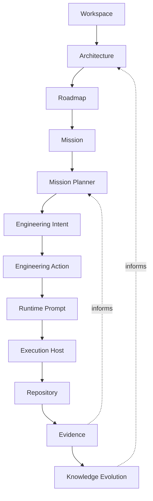
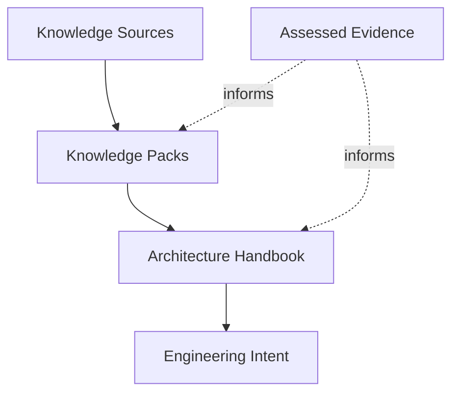
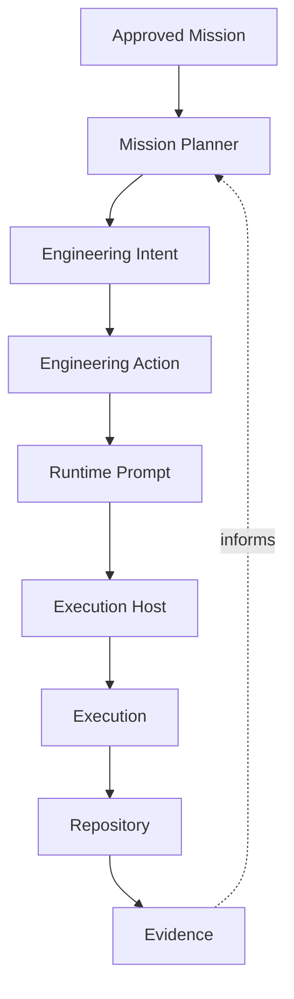
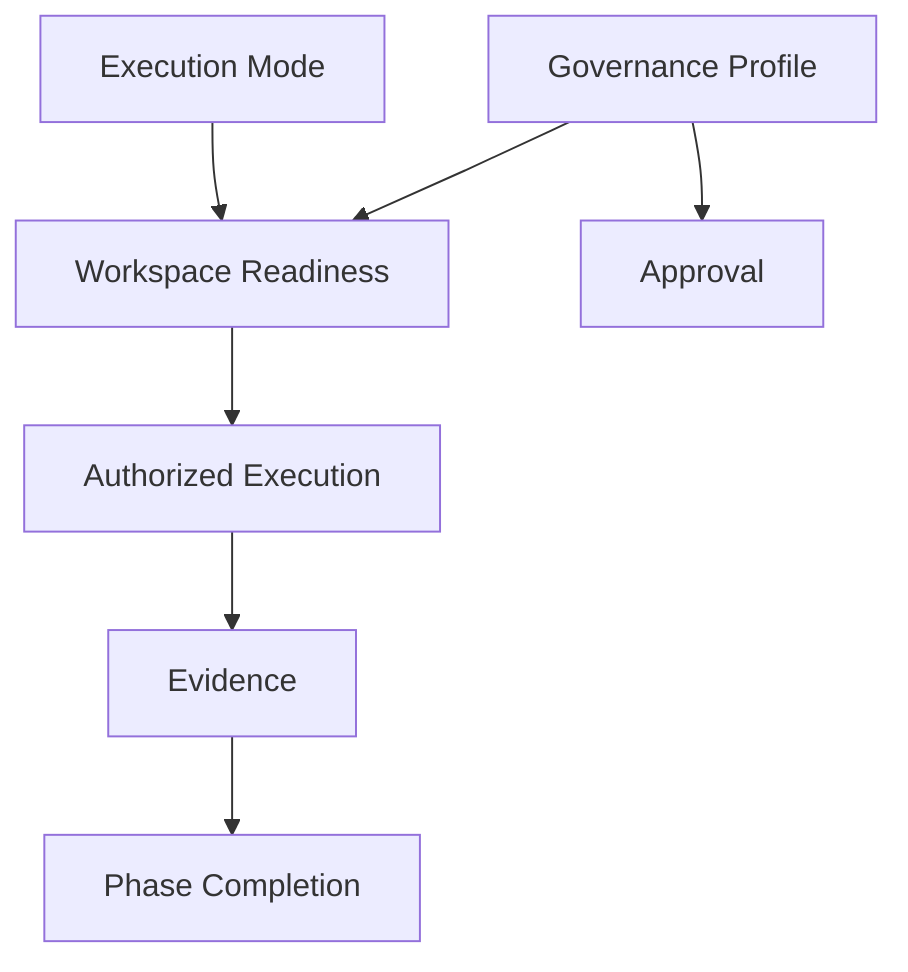
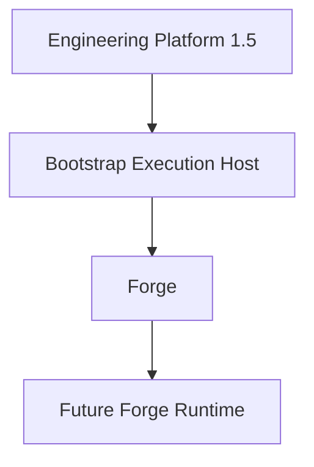

# Forge Core Architecture

## Purpose and authority

This is Forge's canonical conceptual architecture overview. It captures the
architecture that emerged during bootstrap; it neither redesigns Forge nor
implements a Runtime Provider, execution system, Studio, or capability.

The [Forge Constitution](01_CONSTITUTION.md) remains the authority for
permanent principles and boundaries. The [Forge Vision](02_VISION.md) remains
the authority for product direction. This document explains how their
established concepts relate so that future capabilities can evolve without
confusing product knowledge, engineering work, runtime translation, and
execution.

## Architectural philosophy

### Workspace-first product understanding

**Context.** A software product can span repositories, while its identity,
architecture, roadmap, capabilities, and governance must remain coherent.

**Rationale.** Product meaning must remain stable even when its engineering
implementation is distributed across repositories.

**Responsibility.** The Workspace is the product boundary and holds the
context in which repositories and engineering decisions are understood.

**Relationships.** Repositories belong to a Workspace through its Repository
Catalog. Architecture, Roadmap, capabilities, and Governance are organized for
the Workspace rather than for an isolated repository.

**Constraints.** A Workspace is not a repository and does not execute,
inspect, clone, or mutate repositories.

**Future evolution.** Workspace capabilities may deepen product modeling while
preserving the boundary between product understanding and implementation.

### Repository-first engineering and authoritative evidence

**Context.** Engineering outcomes must be assessed from observable facts, not
from a prompt, a runtime claim, or a conversation.

**Rationale.** A repository-grounded basis prevents temporary execution
artifacts and opinions from becoming the account of engineering reality.

**Responsibility.** Repositories implement engineering and provide the
authoritative evidence for repository reality.

**Relationships.** Repository evidence assesses the outcome expected by an
Engineering Intent, contributes to readiness, phase completion, and
Architecture Drift assessment, and continuously informs the Mission Planner.

**Constraints.** Repository evidence cannot silently rewrite the Intent it
assesses. Prompt history, reviewer observations, and runtime output do not
override conflicting repository reality.

**Future evolution.** Evidence capabilities may add reproducible references
and assessments without replacing repository authority.

### Capability-driven evolution

**Context.** Forge's intended responsibilities are broader than the local
bootstrap foundation, but a documented concept is not an implemented behavior.

**Rationale.** Independent capability boundaries prevent direction from being
mistaken for an implicit delivery commitment.

**Responsibility.** Capabilities are the bounded units through which Forge adds
engineering behavior, readiness, governance, knowledge, and execution-related
behavior.

**Relationships.** Each capability is positioned by Workspace architecture and
governance, and can contribute declared knowledge, readiness checks, or
evidence expectations.

**Constraints.** A capability must not be inferred from a concept, runtime, or
adjacent tool. It requires separately bounded intent and governance.

**Future evolution.** Runtime Providers, execution, queues, Studio, and other
future behavior may become independent capabilities with explicit non-goals.

### Knowledge-driven engineering

**Context.** Engineering needs durable product and architectural meaning that
outlasts individual executions.

**Rationale.** Preserving assessed knowledge lets future work build on stable
understanding rather than repeatedly rediscovering it from transient prompts.

**Responsibility.** Forge owns engineering knowledge: it captures, organizes,
and evolves knowledge that informs planning and bounded Intent.

**Relationships.** Knowledge Sources inform Knowledge Packs and the
Architecture Handbook; these inform Engineering Intent. Assessed Evidence may
inform Knowledge Evolution.

**Constraints.** Knowledge Sources remain versioned, read-only evidence
providers. Runtime Prompts, execution transcripts, and generated output are
not automatically authoritative knowledge.

**Future evolution.** Knowledge Distillation may make assessed discoveries more
reusable, subject to the same authority and governance boundaries.

### Human-governed AI engineering

**Context.** AI can analyse, propose, and execute work, but cannot create the
product authority under which it operates.

**Rationale.** Explicit human authority ensures that useful AI behavior remains
answerable to product direction, architecture, and declared scope.

**Responsibility.** Human governance defines Vision, Architecture, approval
boundaries, and progression rules; Forge makes those boundaries operational.

**Relationships.** Humans approve Missions and remain responsible for
governance. Mission Planner creates dynamic Intents within that approval;
Governance Profiles and Execution Modes establish the context in which
readiness and completion are assessed.

**Constraints.** Approval does not alter an Intent, and runtime availability
does not constitute approval. AI output remains bounded by explicit authority.

**Future evolution.** Additional governance models may support broader
collaboration while keeping human authority explicit.

## Primary architectural layers

**Context.** Forge separates product meaning, candidate work, bounded work,
authorization, runtime translation, execution, and learning so that no
temporary artifact becomes the definition of engineering work.

**Responsibility.** The lifecycle assigns a distinct responsibility to every
layer.

| Layer | Responsibility |
| --- | --- |
| Workspace | Establishes product boundary, identity, and operating context. |
| Architecture | Records durable structure, principles, boundaries, and relationships. |
| Roadmap | Frames product direction and sequencing. |
| Mission | Is the Architect-approved contract for objective, architectural boundaries, success criteria, and constitutional constraints. |
| Mission Planner | Iteratively plans, sequences, manages dependencies, evaluates progress, and creates dynamic Intents from evidence. |
| Engineering Intent | Is the model-independent dynamic planning statement of context, goal, decisions, scope, constraints, validation, deliverables, and expected evidence. |
| Engineering Action | Is the smallest intentional executable unit and produces a Runtime Prompt. |
| Runtime Prompt | Is the derived, transient instruction for a particular execution. |
| Execution Host | Performs work using the Runtime Prompt. |
| Repository | Holds implementation reality. |
| Evidence | Connects observable repository outcomes to declared Intent and future planning. |
| Knowledge Evolution | Captures assessed discoveries for future engineering. |

**Relationships.** The lifecycle flows from durable product knowledge through
an approved Mission and iterative planning toward execution. Evidence returns
from the Repository to Mission Planner. Engineering Action is the bridge from
Intent to runtime translation; Runtime Prompt is not canonical knowledge.

**Constraints.** Layers do not silently replace one another. Roadmap and
Backlog do not approve work, Approval does not redefine Intent, and Execution
does not define product or architectural truth.

**Future evolution.** The lifecycle is the conceptual basis for future
planning, governance, Runtime Provider, execution, and evidence capabilities;
it does not claim that those capabilities already exist.

## Workspace layer

**Context.** A product's meaning cannot be reduced to a single engineering
repository.

**Responsibility.** The Workspace owns product identity, roadmap, architecture,
capabilities, and governance. Repositories belong to the Workspace and
implement engineering.

**Relationships.** The Workspace references a Repository Catalog that assigns
canonical and supporting repository roles. It supplies context for Architecture,
Roadmap, Backlog, and Governance.

**Constraints.** Repository identity remains separate from repository role.
The Workspace does not operate repositories, and no repository becomes the
product boundary merely by being canonical.

**Future evolution.** Workspace management may acquire further declarative
capabilities, while repository operations remain outside this layer.

## Knowledge layer

**Context.** Architectural knowledge evolves separately from an individual
engineering execution so that provider instructions do not become the permanent
model.

**Responsibility.** The knowledge layer carries durable inputs and assessed
outcomes of engineering.

**Relationships.** Knowledge Sources are read-only, versioned evidence
providers. Knowledge Packs retain relevant bootstrap or domain knowledge; the
Architecture Handbook organizes durable architecture; Engineering Intent
applies that knowledge to bounded work.

**Constraints.** Knowledge evolves through assessed evidence, not by treating
runtime output, prompt history, or repository changes alone as self-explaining
architecture. Forge does not modify a source merely by registering or
consuming it.

**Future evolution.** Knowledge Distillation and richer handbook capabilities
may be introduced independently from runtime execution.

## Runtime layer

**Context.** Engineering work requires an execution environment, but that
environment must not own the meaning of the work it performs.

**Responsibility.** Forge owns Engineering Intent and related knowledge.
Mission Planner owns iterative planning. Execution Hosts own execution.
Engineering Actions produce Runtime Prompts for a chosen execution context.

**Relationships.** An Engineering Action is the translation boundary between
Forge-owned planning and host-specific execution. An Execution Host may use
tools such as Git, CI, or deployment systems, but those remain external to
Forge's ownership.

**Constraints.** Runtime Prompts are derived and transient. Execution Hosts do
not own Missions, Engineering Intents, or Forge knowledge, and replacing a host must not
require changing engineering meaning.

**Future evolution.** Runtime Provider contracts, prompt derivation, and
execution capabilities are future work; this architecture does not claim they
are implemented.

## Capability layer

**Context.** Forge must evolve without turning product direction into an
implicit implementation commitment.

**Responsibility.** Capabilities are first-class architectural concepts. Each
declares and contributes engineering behavior, readiness, governance,
knowledge, and execution responsibilities as applicable.

**Relationships.** Capabilities operate within Workspace architecture and
governance. They can contribute declarative checks to Workspace Readiness,
expected evidence to Phase Completion, and durable knowledge to the
Architecture Handbook.

**Constraints.** Capabilities evolve independently and retain explicit
boundaries. Documentation about a future capability neither implements it nor
authorizes it.

**Future evolution.** The model permits new capabilities and
marketplace-like distribution concepts without collapsing independent
capability lifecycles into one runtime.

## Governance layer

**Context.** A governed lifecycle must establish both whether work may begin
and whether a declared phase has completed.

**Responsibility.** Execution Modes state execution context; Governance
Profiles state the human authority shape; Workspace Readiness determines
whether a Workspace is prepared for a declared profile; Phase Completion
assesses whether declared criteria have reproducible Evidence.

**Relationships.** Approval is governed by the selected profile. Readiness is
assessed against an execution profile before execution, while Phase Completion
uses evidence after a phase. Repository evidence is authoritative whenever an
assessment concerns repository reality.

**Constraints.** Execution Mode and Governance Profile are catalogs, not
automatic authority. Readiness does not execute work, and Phase Completion does
not grant approval or change Intent.

**Future evolution.** Future capabilities may contribute declared readiness
checks, evidence references, and governance rules without replacing the common
assessment model.

## Architectural boundaries

**Context.** Clear non-ownership boundaries keep Forge focused on governed
engineering rather than adjacent tools.

**Responsibility.** Forge orchestrates engineering knowledge, intent,
governance, and evidence relationships. Forge does not own Git, deployment, or
CI; Execution Hosts execute engineering.

**Relationships.** Repositories remain the source of repository reality, and
Execution Hosts remain replaceable consumers of Forge-owned meaning. Knowledge
remains distinct from Execution so an execution does not define its own
authority.

**Constraints.** Forge is not a Git replacement, deployment platform, CI
server, coding assistant, prompt manager, or IDE replacement. A host's use of
an adjacent tool does not transfer ownership of that tool to Forge.

**Future evolution.** An expanded boundary requires an explicit, separately
governed capability and must preserve runtime independence and human
governance.

## Bootstrap architecture

**Context.** Forge began with a functioning external execution environment so
its architecture could emerge through bounded, evidence-backed engineering.

**Responsibility.** Engineering Platform 1.5 is the temporary bootstrap
Execution Host. It enables bootstrap execution; Forge owns the product model,
engineering knowledge, and future runtime direction.

**Relationships.** Genesis is the bootstrap execution profile. The external
host executes bounded work for the independent Forge repository, while the
resulting repository knowledge informs Forge's future architecture.

**Constraints.** Forge is not a rename of Engineering Platform 1.5 and has no
permanent runtime dependency on it. Future Forge Runtime ownership does not
claim a current Runtime Provider, queue, Studio, or execution implementation.

**Future evolution.** A future Forge Runtime may replace bootstrap-host
responsibilities through stable execution contracts without changing the
authority of the Workspace, Engineering Intent, repository evidence, or human
governance.
