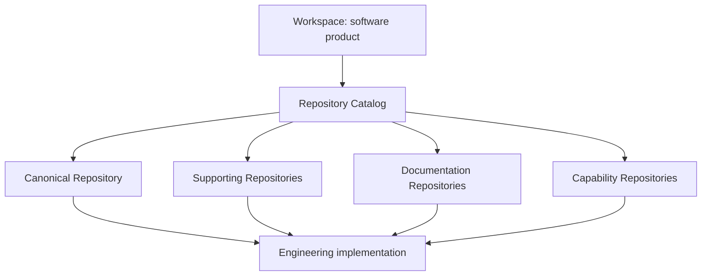
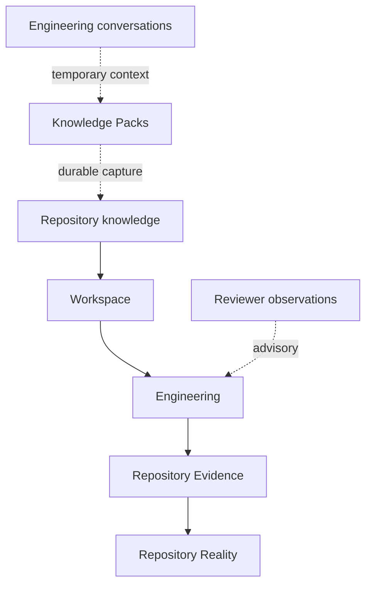

# Forge Workspace & Repository Model

## Purpose and authority

This document is Forge's canonical conceptual architecture for the Workspace
and Repository model established during bootstrap. It elaborates the
[Forge Constitution](01_CONSTITUTION.md), [Forge Vision](02_VISION.md), and
[Forge Core Architecture](03_ARCHITECTURE.md); those records retain their
respective authority. It does not implement repository operations, Workspace
Adoption, Repository Extraction, a Runtime Provider, or an execution system.

## Model at a glance

The model deliberately separates the product boundary from the engineering
assets that implement it. A catalog assigns a role to a repository identity;
repository identity itself does not contain a Workspace role.

## Workspace

**Context.** A software product can be implemented across more than one
repository, while its identity, architecture, roadmap, engineering knowledge,
capabilities, governance, and engineering history must remain coherent.

**Responsibility.** A Workspace represents that software product and is its
highest engineering boundary. It owns product identity, architecture, roadmap,
engineering knowledge, capabilities, governance, and the context in which
engineering history is understood. It references its Repository Catalog and
selects its Engineering Mode and Governance Profile.

**Rationale.** Bootstrap introduced this distinction because reducing product
meaning to one checkout confuses product responsibility with implementation
location. A product can survive repository changes, additions, or distribution
without losing its architectural and governance context.

**Relationships.** The Workspace owns the Repository Catalog relationship and
supplies product context for Architecture, Roadmap, Backlog, Governance, and
Engineering Intent. Repositories contribute engineering implementation and
repository evidence to that Workspace.

**Constraints.** A Workspace is not a repository. It does not execute,
discover, clone, inspect, or mutate repositories. It does not make an
Engineering Mode or Governance Profile into automatic authority.

**Future evolution.** Workspace capabilities may deepen declarative product
modeling while preserving the separation between product understanding and
repository operations.

## Repository

**Context.** Engineering implementation needs an observable, version-controlled
source of truth.

**Responsibility.** A Repository is an engineering asset belonging to a
Workspace. It contains engineering implementation and remains the source of
truth for repository reality and the evidence needed to assess that reality.

**Rationale.** Implementation truth must be assessable from observable
repository evidence rather than reviewer observations, conversation, prompt
history, or runtime claims.

**Relationships.** A Repository is identified independently and is assigned a
Workspace role only through a Repository Catalog. Its evidence evaluates
Engineering Intent and contributes to readiness, phase completion, and
Architecture Drift assessment.

**Constraints.** Repositories never replace the Workspace as the product
boundary. A Repository does not define product architecture, governance, or
product identity merely by being cataloged or canonical. Its role is not part
of its identity.

**Future evolution.** Repositories may remain distributed across client,
firmware, documentation, capability, and infrastructure concerns without
changing their evidence-first responsibility.

## Repository Catalog

**Context.** A Workspace needs a stable way to express how independently
identified repositories contribute to one product.

**Responsibility.** The Repository Catalog is owned by a Workspace and maps
repository identities to catalog roles. It has exactly one canonical entry and
may contain supporting, documentation, and capability entries.

**Rationale.** Keeping role in the catalog preserves the distinction between a
repository's identity and its product responsibility. It also lets one product
remain legible across multiple engineering boundaries.

**Relationships.** The Workspace references one catalog. The catalog points to
repository identities and establishes the single Canonical Repository and any
other role-bearing repositories.

**Constraints.** The bootstrap catalog is declarative and mutation-free; it is
not a Git client or repository-operations API. A repository may not occupy
more than one catalog role. The current catalog roles are exactly canonical,
supporting, documentation, and capability.

**Future evolution.** Composite validation and richer declarative catalog
capabilities may evolve independently, without embedding repository operations
in the Workspace model.

### Canonical Repository

**Context.** A multi-repository product still needs a clear engineering center
of gravity.

**Responsibility.** Exactly one Canonical Repository exists per Workspace. It
is the primary product source of truth within the Repository Catalog.

**Rationale.** The single canonical assignment provides an unambiguous center
of gravity for a product while avoiding the false claim that all implementation
must live in that repository.

**Relationships.** The Workspace selects it through the Repository Catalog;
supporting, documentation, and capability repositories remain separately
attributable to the same product.

**Constraints.** Canonical does not mean exclusive. It does not turn the
repository into the Workspace or give it ownership of every implementation,
product decision, or external system.

**Future evolution.** The canonical relationship remains declarative as
additional repository-oriented capabilities are introduced.

### Supporting Repositories

**Context.** Product engineering can require repositories that contribute to
the product without being its center of gravity.

**Responsibility.** A Supporting Repository contains product-supporting
engineering implementation.

**Rationale.** This role records contribution without collapsing the product
boundary or misidentifying supporting implementation as canonical.

**Relationships.** It is cataloged by a Workspace alongside the Canonical
Repository and may supply repository evidence for its own implementation.

**Constraints.** Supporting is a catalog role, not a property of repository
identity, and does not confer product-architecture authority.

**Future evolution.** More specific supporting responsibilities may be
described by future capabilities without changing the base role.

### Documentation Repositories

**Context.** Product documentation may need an independent engineering
boundary while remaining attributable to the same product.

**Responsibility.** A Documentation Repository holds product documentation as
an engineering asset.

**Rationale.** The role makes documentation contribution explicit without
requiring it to be co-located with the canonical implementation.

**Relationships.** It belongs to the Workspace through the Repository Catalog
and remains a repository whose version-controlled evidence is authoritative
for its own contents.

**Constraints.** A Documentation Repository does not replace Workspace-owned
architecture, governance, or product identity. The role is declarative and
does not imply documentation-generation behavior.

**Future evolution.** Documentation capabilities may evolve separately while
preserving repository-first evidence and Workspace-first product context.

### Capability Repositories

**Context.** A product may distribute independently evolving engineering
capabilities across repositories.

**Responsibility.** A Capability Repository is a catalog role for a repository
that contributes a future capability to the Workspace.

**Rationale.** The role accommodates independent capability boundaries without
making all capabilities part of the Canonical Repository.

**Relationships.** It is referenced by the Workspace's Repository Catalog and
remains subject to the same explicit capability, governance, and evidence
boundaries as other repositories.

**Constraints.** The role does not implement, execute, authorize, or publish a
capability. Documenting a capability repository is not an implementation
claim.

**Future evolution.** Future capability distribution may add declarative
relationships while retaining separately governed capability lifecycles.

### Knowledge repositories

**Context.** Forge owns durable engineering knowledge in repositories, while
conversations are temporary and external Knowledge Sources remain read-only
evidence providers.

**Responsibility.** A repository can hold version-controlled engineering
knowledge and therefore provide durable repository knowledge to its Workspace.

**Rationale.** Repository-held knowledge can be reviewed, linked, and carried
forward by later engineering; it bridges temporary conversations into durable
product context.

**Relationships.** Repository knowledge informs architecture and Engineering
Intent. Knowledge Sources and Knowledge Packs remain distinct: Sources are
external, versioned read-only evidence providers, and Packs are bootstrap or
domain knowledge inputs.

**Constraints.** `Knowledge Repository` is not a fifth current Repository
Catalog role. The catalog roles remain canonical, supporting, documentation,
and capability. Repository knowledge does not become authoritative merely by
being present; constitutional authority and assessed repository evidence still
apply.

**Future evolution.** A separately governed knowledge capability may describe
additional repository knowledge relationships without changing the present
catalog-role contract.

## Multi-repository product model

**Context.** One product can have distinct engineering boundaries for clients,
firmware, documentation, capabilities, or infrastructure.

**Responsibility.** The Workspace keeps those repositories inside one product
model, while each repository retains its own implementation and evidence
boundary.

**Rationale.** Multi-repository support prevents product identity and
architecture from being fragmented by implementation topology. It also avoids
forcing unrelated implementation concerns into a single repository.

**Relationships.** The Repository Catalog connects the product Workspace to
its Canonical Repository and any role-bearing repositories. Repository
evidence stays local to the repository that supplies it.

**Constraints.** Workspace remains the product boundary; repositories remain
engineering boundaries. Cataloging repositories does not create repository
operations or a shared runtime.

**Future evolution.** Additional repository types or cross-repository
relationships require explicit architectural and capability decisions.

## Workspace Adoption

**Context.** An existing software product can need Forge's product model
without having started as a Forge Workspace.

**Responsibility.** Workspace Adoption is the future conceptual boundary for
bringing an existing product into a Workspace: importing repository references,
selecting one Canonical Repository, and discovering relevant engineering
structure.

**Rationale.** Adoption lets Forge establish coherent product context for an
existing product rather than requiring a greenfield origin.

**Relationships.** Adoption would populate or inform the declarative Workspace
and Repository Catalog model. Any discovered facts remain subject to the
repository-first evidence principle.

**Constraints.** Adoption is not implemented by the current Workspace model.
It must not be read as current repository discovery, cloning, inspection, or
mutation behavior.

**Future evolution.** A separately bounded capability may define adoption
contracts, evidence, governance, and implementation without changing the
current declarative model.

## Repository Extraction

**Context.** Existing repositories contain observable implementation and
engineering evidence from which architectural patterns and capability
knowledge may be assessed.

**Responsibility.** Repository Extraction is the future conceptual boundary
for analyzing repositories to extract engineering patterns, architecture,
capabilities, and engineering knowledge.

**Rationale.** Extraction can help establish or refine Workspace understanding
from existing implementation without confusing analysis with authority.

**Relationships.** Extraction may inform Workspace Adoption, Knowledge Packs,
Architecture Handbook material, or future engineering decisions. The resulting
understanding remains accountable to repository evidence.

**Constraints.** Extraction does not become the source of truth: repository
knowledge remains version controlled. No current Forge behavior performs
repository inspection, cloning, extraction, remote retrieval, or mutation.

**Future evolution.** Any extraction capability requires separately bounded
intent, governance, evidence, and implementation.

## Repository-first engineering

**Context.** Engineering work is discussed in reviews and conversations and
can be represented by runtime prompts, but those accounts can be incomplete,
stale, or mistaken.

**Responsibility.** Repository evidence is authoritative for repository
reality. Reviewers remain advisory, engineering conversations remain
temporary, and Knowledge Packs bridge relevant conversation-derived bootstrap
context into repository knowledge.

**Rationale.** The repository contains the implemented state and observable
evidence needed for assessment, whereas a prompt, conversation, reviewer, or
runtime output cannot override conflicting repository reality.

**Relationships.** Repository evidence assesses Engineering Intent and informs
readiness, Phase Completion, and Architecture Drift. Knowledge Packs preserve
relevant bootstrap context without replacing version-controlled knowledge.

**Constraints.** Repository evidence evaluates an Intent; it does not silently
rewrite it. Runtime prompts and execution artifacts are derived and transient,
not canonical architecture or repository truth.

**Future evolution.** Evidence and knowledge-distillation capabilities may add
reproducible references and assessed capture while preserving this authority
order.

## Workspace lifecycle and operating profiles

**Context.** Bootstrap distinguishes a Workspace's enduring product boundary
from the execution context and human authority used for a bounded increment.

**Responsibility.** Workspace lifecycle describes the product's long-running
evolution; Execution Modes describe execution context; Governance Profiles
describe the human authority shape.

**Rationale.** Keeping these dimensions independent prevents a maturity label,
runtime, or governance selection from being mistaken for a product boundary or
automatic approval.

**Relationships.** The established bootstrap lifecycle starts with the Genesis
execution profile and has a future Managed Readiness boundary. A directional
product lifecycle can be expressed as Greenfield → Genesis → Managed →
Production → Evolution, while the Workspace continues to be the product
boundary throughout.

**Constraints.** Only Genesis and Managed Readiness are established Forge
profiles. Greenfield, Production, and Evolution are not current execution
modes, Governance Profiles, or implemented lifecycle capabilities; this
capture does not define their checks or transitions. Execution Modes remain
independent from Governance Profiles.

**Future evolution.** A future, separately governed lifecycle capability may
define lifecycle states, transition evidence, and their relationship to
readiness without redefining the Workspace or granting authority automatically.

## Architectural boundaries

**Context.** Product understanding, repository implementation, host execution,
and external knowledge have different owners.

**Responsibility.** The model maintains explicit ownership boundaries:

| Boundary | Architectural rule |
| --- | --- |
| Workspace | Does not execute engineering or operate repositories. |
| Repository | Does not define product architecture, product identity, or governance. |
| Execution Host | Does not own Workspaces, Forge knowledge, or Engineering Intent. |
| Runtime Provider | Does not own repositories or redefine canonical engineering meaning. |
| Knowledge Source | Remains an external, versioned, read-only evidence provider. |

**Rationale.** These boundaries keep Forge independent of a particular host,
provider, implementation topology, or external source.

**Relationships.** Forge owns the product model and engineering knowledge;
repositories supply implementation and repository evidence; Execution Hosts
execute through derived runtime artifacts; Knowledge Sources inform, but do
not replace, Forge-owned knowledge.

**Constraints.** Engineering Platform 1.5 is only the temporary bootstrap
Execution Host. It neither owns the Forge Workspace nor creates a permanent
runtime dependency. External knowledge is never silently adopted as product
architecture.

**Future evolution.** New capabilities may enrich these boundaries only with
explicit architecture, governance, and evidence while retaining runtime
independence and human authority.

## Future evolution

**Context.** Bootstrap identified several directions while keeping unimplemented
behavior outside the current Workspace and Repository model.

**Responsibility.** The model reserves conceptual room for Workspace overlays,
Repository Extraction, Workspace migration, Workspace templates, Product
Identity, and rebranding capability.

**Rationale.** These directions may help products evolve, be adopted, or be
represented consistently without collapsing the distinction between a
Workspace and its repositories.

**Relationships.** Product Identity is already an architectural capability
boundary; public branding remains separately governed. Overlays, migration,
templates, and extraction must continue to respect catalog roles,
repository-first evidence, and Workspace-first product context.

**Constraints.** None of these directions is implemented or authorized by this
capture. They do not add a repository role, perform migration, inspect a
repository, or change public identity.

**Future evolution.** Each direction requires separately bounded intent,
architecture, governance, validation, and evidence before implementation.
