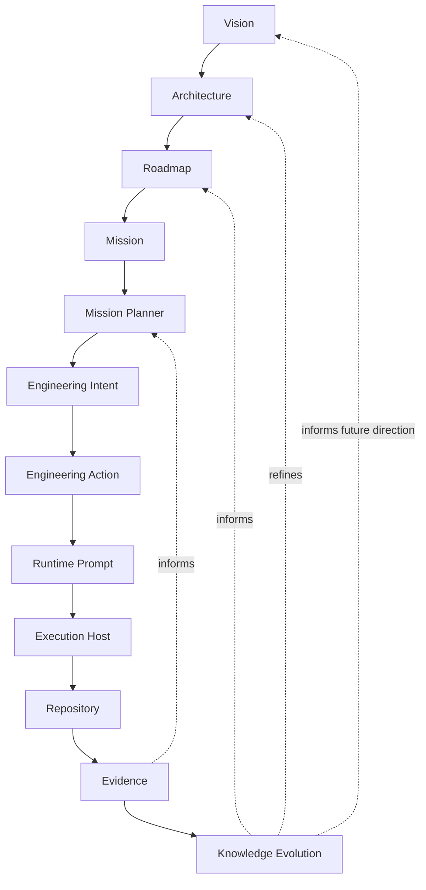
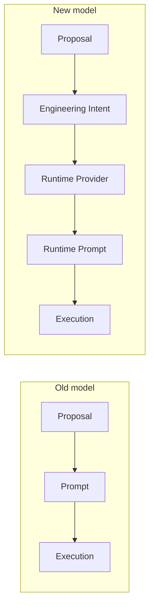
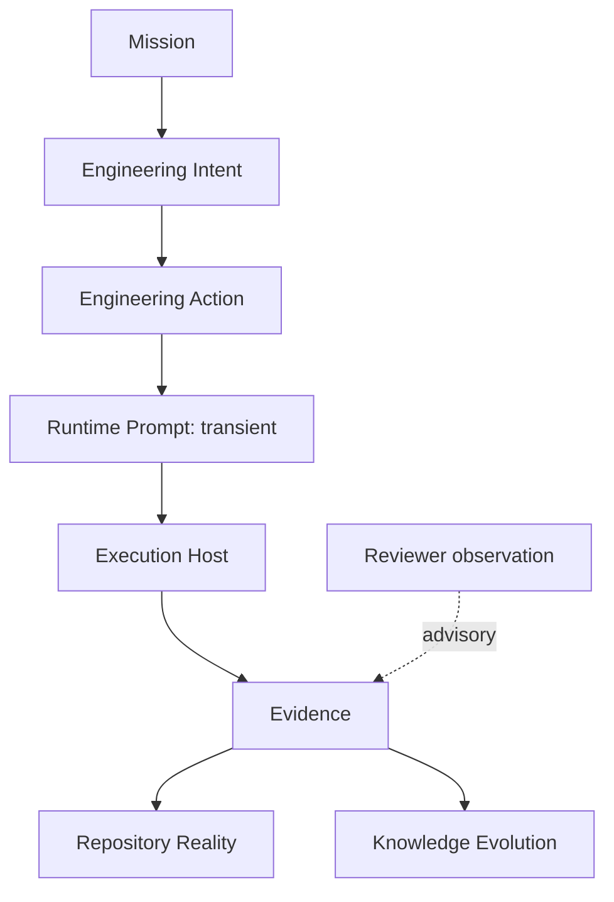
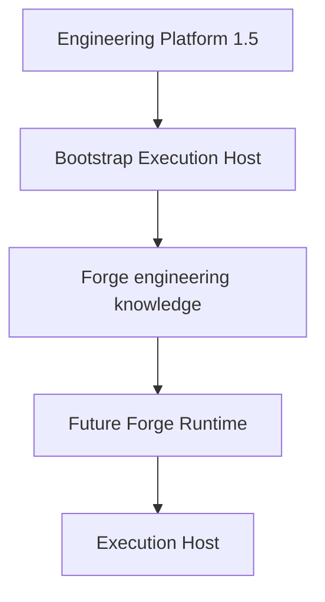
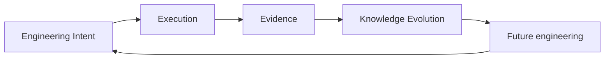

# Forge Engineering Model

## Purpose and authority

This document is Forge's canonical conceptual Engineering Model captured during bootstrap. It explains how engineering is represented, evolves, becomes execution, and becomes evidence. It elaborates the [Forge Constitution](01_CONSTITUTION.md), [Forge Vision](02_VISION.md), [Forge Core Architecture](03_ARCHITECTURE.md), and [Forge Workspace & Repository Model](04_WORKSPACE_REPOSITORY.md); those records retain their respective authority.

This capture describes established engineering knowledge. It does not create an Engineering Intent lifecycle, implement a Runtime Provider, Mission Runtime, queue, execution host, approval mechanism, or repository operation.

## Engineering lifecycle

Forge's canonical lifecycle is:

The lifecycle distinguishes enduring product direction from the
Architect-approved Mission, Forge-owned iterative planning, dynamic tactical
Intent, executable Action, replaceable execution, and observable
assessment. Each stage exists so that a later stage cannot silently assume the
authority of an earlier one: planning is not execution, an Intent is not an
Action, and a runtime representation is not engineering knowledge.

**Context.** Forge needs one conceptual path from long-term direction through bounded work to assessed learning.

**Responsibility.** The lifecycle orders the relationships among direction, structure, opportunity, intent, governance, translation, execution, evidence, and learning without making the sequence an implementation workflow.

**Rationale.** Explicit stages preserve the authority boundary of each engineering concern and make the transition from knowledge to execution assessable.

**Relationships.** Vision begins the directional chain; Knowledge Evolution feeds assessed learning back into future direction, structure, and opportunity.

**Constraints.** The lifecycle does not implement state transitions, select work, grant authority, invoke a runtime, or determine completion without Evidence.

**Future evolution.** Future planning, governance, provider, execution, evidence, and knowledge capabilities may realize individual boundaries without collapsing their distinct responsibilities.

## Vision

**Context.** Vision defines Forge's long-term direction and the outcome that its engineering serves.

**Responsibility.** Vision constrains Architecture by stating the durable product purpose and direction. It changes rarely because it supplies stable orientation across many engineering increments.

**Rationale.** Stable direction prevents individually reasonable increments from accumulating into an incoherent product.

**Relationships.** Architecture translates Vision into product structure; Roadmap expresses strategic movement within that structure.

**Constraints.** Vision does not describe implementation, select a backlog item, authorize an increment, or execute engineering.

**Future evolution.** A changed Vision requires deliberate, governed revision and subsequent architectural reconciliation; routine execution cannot change it implicitly.

## Architecture

**Context.** Architecture translates Vision into a coherent product structure.

**Responsibility.** Architecture defines concepts, relationships, boundaries, and invariants. It establishes the structural meaning against which proposed and implemented engineering can be assessed.

**Rationale.** The model separates what the product is from how a particular increment or runtime happens to implement it.

**Relationships.** Architecture is constrained by Vision, informs Roadmap and Backlog, and constrains Engineering Intent. Repository evidence can assess whether implementation reality preserves its invariants.

**Constraints.** Architecture is conceptual: it does not describe implementation, make a proposal executable, grant approval, or become a runtime instruction.

**Future evolution.** Architecture may evolve through explicit, evidence-based decisions while preserving constitutional invariants and the distinction between product knowledge and execution artifacts.

## Roadmap

**Context.** A product needs a strategic view of how its capabilities evolve without reducing that evolution to an implementation schedule.

**Responsibility.** Roadmap describes capability-oriented strategic evolution: the direction and sequencing of meaningful product change.

**Rationale.** Capability orientation retains the connection to Vision and Architecture while leaving bounded engineering choices to later stages.

**Relationships.** Roadmap is informed by Architecture and Vision, and it
provides strategic direction for Missions.

**Constraints.** Roadmap is not a Mission, implementation plan, execution
plan, approval, or Runtime Prompt.

## Mission

**Context.** A strategic engineering objective needs a durable human-approved
contract without assuming that tactical work is known in advance.

**Responsibility.** Mission defines the engineering objective, architectural
boundaries, success criteria, and constitutional constraints.

**Rationale.** Strategic coordination must remain separate from executable
work so Mission progress does not turn a broad objective into one runtime
instruction.

**Relationships.** Mission is informed by Roadmap and constrains the Mission
Planner. It does not contain a predeclared Intent list.

**Constraints.** Mission is strategic and not executable.

## Mission Planner

**Responsibility.** Mission Planner owns engineering planning, sequencing,
dependency management, progress evaluation, dynamic Intent creation, and
reprioritisation within an approved Mission.

**Relationships.** Repository Evidence continuously returns to the Planner.
The Planner may create, supersede, merge, split, or retire active Intents.

**Constraints.** Mission Planner is Forge-owned future planning, not human
governance, a scheduler, an Execution Host, or autonomous execution.

**Future evolution.** As evidence and knowledge mature, Roadmap may be refined through governance without allowing implementation convenience alone to define product direction.

## Backlog

**Context.** Engineering opportunities need a visible place before they become bounded proposed work.

**Responsibility.** Backlog contains engineering opportunities derived from the Roadmap, Architecture, engineering discoveries, and capability evolution.

**Rationale.** Recording opportunities separately from execution avoids mistaking a useful idea or discovery for authorized work.

**Relationships.** Backlog operationalizes Roadmap direction and receives architecture- and evidence-informed discoveries. It is the source from which a Proposal may be formed.

**Constraints.** A backlog item is neither implementation planning, a Proposal, an Engineering Intent, nor authorization to execute.

**Future evolution.** Backlog content and ordering can change as capability knowledge evolves, subject to the product and governance boundaries that constrain it.

## Proposal

**Context.** A candidate opportunity needs an accountable explanation before it can be expressed as the canonical instruction for bounded work.

**Responsibility.** Proposal represents a suggested engineering increment. It explains why the increment matters, its bounded scope, dependencies, risks, and the evidence that motivates it.

**Rationale.** A proposal makes the case for work reviewable without treating that case as the work itself.

**Relationships.** Proposal is informed by Backlog, Roadmap, Architecture, and available evidence. It can bound and justify a subsequent Engineering Intent.

**Constraints.** Proposal is not execution, approval, an Engineering Intent, or a Runtime Prompt. Its lifecycle labels do not perform engineering or grant authority.

**Future evolution.** Proposal forms may become richer through separately governed capabilities while retaining their role as a suggestion rather than an execution mechanism.

## Engineering Intent

**Context.** Bootstrap established that a prompt cannot be the durable meaning of engineering work because it varies with the runtime that receives it.

**Responsibility.** Engineering Intent is the canonical tactical dynamic
planning artifact created by the Mission Planner. It owns engineering rationale,
boundaries, validation, evidence, and architectural traceability for coherent
work and contains Engineering Actions.

**Rationale.** A canonical intent preserves engineering meaning across providers and permits repository reality to be assessed against stable criteria rather than prompt wording.

**Relationships.** An Intent is created within a Mission and constrained by
Vision, Architecture, and Roadmap. It contains Actions; Evidence evaluates its
declared outcome and informs future planning.

**Constraints.** Intent neither grants approval nor executes work and does not
generate a Runtime Prompt directly. It is not redefined by a Runtime Prompt,
execution output, reviewer observation, or repository content.

Active Intents may be created, superseded, merged, split, or disappear as
planning evolves. Historical Intents remain immutable.

**Future evolution.** Durable intent contracts, validation, migration, and lifecycle behavior require separately bounded and governed capabilities. This model does not implement them.

## Engineering Action

**Context.** A tactical Intent can include more work than one safe execution
prompt.

**Responsibility.** Engineering Action is the smallest intentional, executable
engineering unit. It produces a Runtime Prompt for one bounded change,
documentation update, repair, qualification step, or prompt production.

**Rationale.** The Action boundary prevents a coherent Intent from being
mistaken for a one-to-one execution instruction.

**Relationships.** An Action is contained by an Intent and produces a
provider-specific Runtime Prompt.

**Constraints.** An Action cannot expand its Intent, replace human governance,
or redefine architecture.

## Approval

**Context.** Bounded engineering must be subject to explicit human governance rather than a runtime's availability or generated instruction.

**Responsibility.** Approval explicitly authorizes progression of an Engineering Intent under the applicable governance model.

**Rationale.** Separating authority from representation preserves human control and stops a proposed or generated artifact from becoming self-authorizing.

**Relationships.** Approval evaluates an Engineering Intent and permits its
Actions to progress. It is independent from provider selection.

**Constraints.** Approval does not alter the Intent, generate a prompt, invoke a provider, or execute engineering. A provider cannot infer approval.

**Future evolution.** Approval mechanisms may be modeled through future governance capabilities, provided explicit human authority remains independent of execution.

## Runtime Provider

**Context.** Different runtimes need different execution instructions while the engineering meaning must remain stable.

**Responsibility.** Runtime Providers are future consumers of
Action-produced, runtime-specific prompts. Codex CLI, Claude Code, Gemini,
and future providers are examples.

**Rationale.** Translation at the provider boundary enables runtime choice without moving engineering knowledge into a provider-specific format.

**Relationships.** A Runtime Provider consumes an Action-produced Runtime
Prompt for an Execution Host. Forge retains ownership of engineering knowledge.

**Constraints.** A Provider does not own, reinterpret, approve, or make canonical the engineering work. It does not execute merely by generating a prompt.

**Future evolution.** Provider contracts may be added independently for new runtimes while preserving Intent as the stable source and runtime replaceability.

## Runtime Prompt

**Context.** An execution runtime needs an instruction expressed in its own
syntax, conventions, and operational context.

**Responsibility.** A Runtime Prompt carries the provider-specific,
execution-specific representation produced by an Engineering Action.

**Rationale.** Treating this representation as disposable protects the canonical engineering model from runtime changes and prompt-format drift.

**Relationships.** Runtime Prompt is produced from an Engineering Action and
is consumed by an Execution Host or future Runtime Provider.

**Constraints.** Runtime Prompts are transient, provider-specific, and disposable. They are never canonical engineering knowledge, evidence, approval, or the basis for Architecture Drift.

**Future evolution.** Prompt formats may change, be regenerated, or disappear with a provider without changing the Intent they represent.

## Execution

**Context.** Engineering work must be performed in a concrete environment, but that environment should not define Forge's product or knowledge model.

**Responsibility.** Execution Hosts execute engineering from Runtime Prompts within the authority, scope, constraints, validation, and expected evidence declared by the approved Intent.

**Rationale.** Replaceable execution keeps operational infrastructure from becoming an owner of engineering knowledge.

**Relationships.** An Execution Host consumes a Runtime Prompt and changes a
Repository, whose observable reality provides Evidence. During bootstrap,
Engineering Platform 1.5 is the temporary Bootstrap Execution Host; future
Forge Runtime can relate to an Execution Host without collapsing boundaries.

**Constraints.** Execution is replaceable and never owns engineering knowledge. It cannot approve itself, redefine Intent, or make completion claims authoritative.

**Future evolution.** Future execution capabilities may introduce managed hosts or runtime contracts only through separately governed architecture and must preserve the host's replaceability.

## Evidence

**Context.** A result must be assessable against the declared engineering outcome rather than accepted from an execution or review claim.

**Responsibility.** Evidence records the observable basis for assessing completion. Repository evidence is authoritative for repository reality.

**Rationale.** Evidence-first assessment makes completion reproducible and keeps success grounded in what the repository demonstrably contains.

**Relationships.** Repository reality provides evidence; Evidence is assessed
against Engineering Intent and informs the Mission Planner, Phase Completion,
Architecture Drift, and Knowledge Evolution. Reviewer observations remain
advisory.

**Constraints.** Evidence does not grant approval, execute work, or silently rewrite the Intent. A review observation, prompt, or runtime claim cannot override conflicting repository evidence.

**Future evolution.** Evidence capabilities may improve references, assessment, and reproducibility without weakening repository-first authority.

## Knowledge Evolution

**Context.** Engineering should leave the product more understandable than it was before the increment began.

**Responsibility.** Knowledge Evolution captures assessed learning from evidence into durable repository-held knowledge that can inform future Vision, Architecture, Roadmap, Backlog, Proposals, and Intents.

**Rationale.** This closes the engineering loop: execution produces evidence, evidence evolves knowledge, and knowledge evolves future engineering.

**Relationships.** Knowledge Evolution consumes evidence without replacing the authority of constitutional or architectural records. It supplies future planning and direction through their governed relationships.

**Constraints.** Knowledge Evolution is not automatic scope expansion, a retroactive approval, or a license to rewrite canonical knowledge without governance and evidence.

**Future evolution.** Future knowledge capabilities may formalize capture and consumption while retaining repository ownership and the distinction between bootstrap sources, observations, and canonical knowledge.

## Engineering Intent versus Prompt

Bootstrap exposed a necessary architectural change:

The old model made Prompt the direct bridge from Proposal to Execution. That made the durable meaning of work vulnerable to provider syntax, prompt quality, and execution-host conventions. The new model inserts Engineering Intent as the canonical, model-independent artifact and assigns prompt generation to Runtime Providers. The prompt becomes a transient execution representation, while Approval remains explicit and independent from Runtime.

## Intent, execution, and evidence boundaries

This boundary keeps the declared objective and the observed result distinct: an Intent states what should be true, repository evidence shows what is true, and neither a prompt nor an execution host can substitute for either.

## Execution Hosts

During bootstrap, Engineering Platform 1.5 is the temporary Bootstrap Execution Host. This enables bounded work without making Forge a feature, rename, or architectural dependency of Engineering Platform 1.5.

Forge owns engineering: its knowledge, model, and future direction. Execution Hosts own execution: they perform provider-specific work and generate outcomes that can become evidence. A future Forge Runtime may coordinate an Execution Host, but it must not erase this ownership boundary.

**Context.** An Execution Host is the replaceable environment in which runtime-specific work occurs.

**Responsibility.** It receives execution-specific work and produces observable outcomes; it owns neither Forge's product model nor its engineering knowledge.

**Relationships.** A Runtime Provider supplies a Runtime Prompt to an Execution Host; host outcomes contribute Evidence for the Engineering Intent.

**Constraints.** The host does not own or redefine Intent, approval, architecture, or repository truth. Engineering Platform 1.5 remains temporary bootstrap infrastructure, not Forge architecture.

**Future evolution.** Forge Runtime and future host relationships require separately governed capabilities and stable execution contracts.

## The closed engineering loop

The loop is deliberately evidence-led. Execution yields assessable evidence; evidence evolves repository knowledge; that knowledge informs future engineering. This supports continuous learning without allowing temporary runtime artifacts or unverified outcomes to become architecture.
