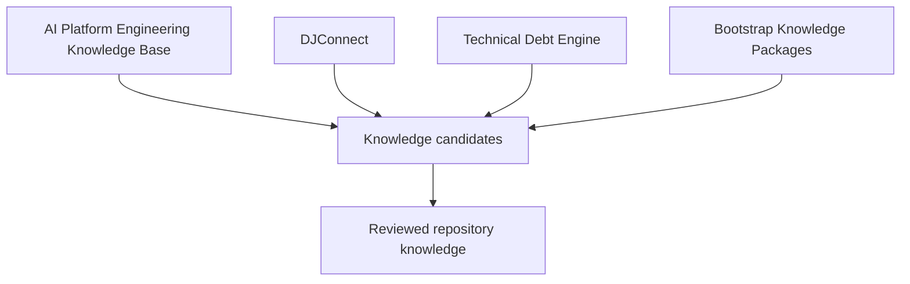
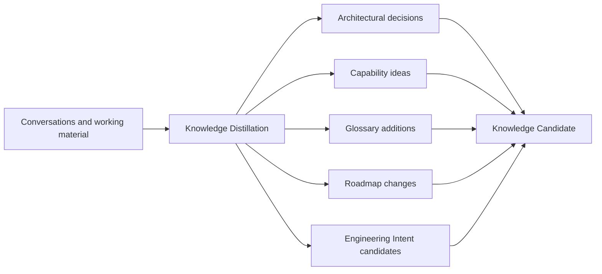
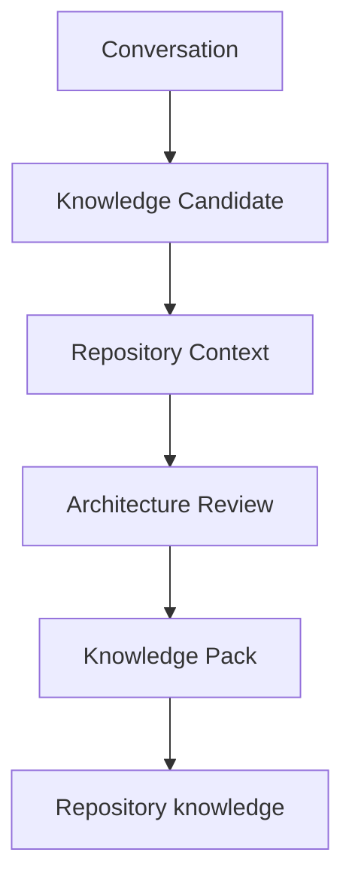
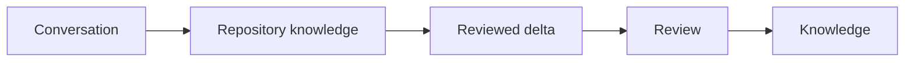
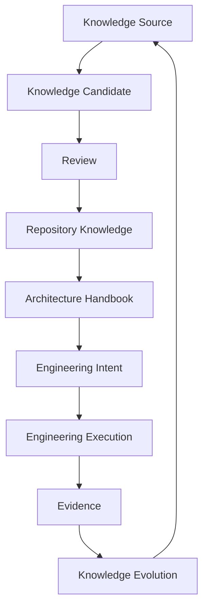
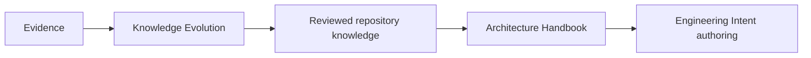
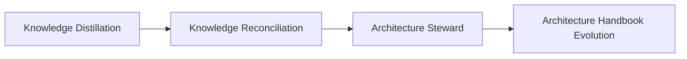

# Forge Knowledge Model

## Purpose and authority

This document is Forge's canonical conceptual Knowledge Model captured during
bootstrap. It explains where engineering knowledge originates, how it evolves,
how it becomes architecture, and how it influences engineering. It elaborates
the [Forge Constitution](01_CONSTITUTION.md), [Forge Vision](02_VISION.md),
[Forge Core Architecture](03_ARCHITECTURE.md), [Forge Workspace & Repository
Model](04_WORKSPACE_REPOSITORY.md), and [Forge Engineering
Model](05_ENGINEERING_MODEL.md). Those records retain their respective
authority.

This capture records established bootstrap knowledge only. It does not
implement Knowledge Distillation, Knowledge Reconciliation, an Architecture
Steward, repository retrieval or mutation, a Runtime, or an automated
Architecture Handbook.

## Knowledge philosophy

**Context.** Engineering appears in conversations, workshops, reviews, and
runtime prompts, yet those forms are temporary and can be incomplete or
superseded.

**Responsibility.** Repository-held knowledge is Forge's durable engineering
knowledge. It is versioned, reviewable, linkable, and able to evolve with the
product.

**Rationale.** Architectural understanding must remain available after a
conversation, provider, runtime prompt, or execution context disappears.
Repository placement makes its origin and changes assessable by later
engineering.

**Relationships.** This realizes Constitution Article 8 and works with
repository-first evidence: repository evidence is authoritative for repository
reality, while reviewed repository knowledge supplies durable context.

**Constraints.** Conversations, runtime prompts, and temporary execution
context are not canonical knowledge and cannot establish durable architectural
authority by themselves.

**Future evolution.** Future knowledge capabilities may improve capture,
comparison, and stewardship, but retain repository ownership and existing
constitutional and architectural authority.

## Canonical knowledge sources

**Context.** Forge bootstrap drew from several sources with distinct purposes.

**Responsibility.** The AI Platform Engineering Knowledge Base supplies generic
governed-engineering and knowledge principles. DJConnect supplies
repository-first and bounded-increment reference patterns. Technical Debt
Engine supplies proof, reconciliation, and evidence-oriented reference
patterns. Bootstrap Knowledge Packages preserve discoveries from temporary
bootstrap work so they can be reconciled.

**Rationale.** Keeping sources independent preserves their provenance,
expertise, and boundaries. A useful source is not automatically Forge product
architecture, and no source needs to be rewritten into another to inform a
review.

**Relationships.** Sources can produce Knowledge Candidates; reviewed
repository-held knowledge can inform Architecture, the Architecture Handbook,
and Engineering Intent. They remain distinct from Repository Context, the
comparison baseline.

**Constraints.** Sources are inputs, not automatic authority transfers.
External sources remain independent and read-only from Forge's perspective;
their content cannot silently replace Forge-owned repository knowledge.

**Future evolution.** Additional sources may be considered through governed
knowledge work without changing the distinct roles of bootstrap sources.

## Bootstrap Knowledge Packages

**Context.** Bootstrap conversations can reveal architectural discoveries, but
the conversations themselves are temporary.

**Responsibility.** Bootstrap Knowledge Packages preserve relevant discoveries
as bootstrap sources and bridge temporary context into a form that can be
compared and reviewed.

**Rationale.** The bridge retains useful discovery without treating a chat as
the durable record. It lets reviewers understand what was proposed while
keeping repository knowledge accountable to repository reality.

**Relationships.** Bootstrap Knowledge Packages are the bootstrap form of a
Knowledge Pack. They inform Knowledge Reconciliation and can contribute to a
reviewed repository update. After reconciliation, the repository is
authoritative, not the originating conversation or package.

**Constraints.** A package is neither an automatic repository update nor a
replacement for constitutional, architectural, or repository-evidence
authority. It does not preserve a conversation as permanent authority.

**Future evolution.** Knowledge Packs may become more structured, but remain
a reviewed input to repository knowledge rather than a parallel source of truth.

## Knowledge Distillation

**Context.** Architectural signals may occur in ChatGPT, Claude, and Gemini
conversations; meeting transcripts; architecture workshops; design reviews;
and engineering notes.

**Responsibility.** Knowledge Distillation extracts candidate architectural
decisions, capability ideas, glossary additions, roadmap changes, and
Engineering Intent candidates from such material.

**Rationale.** Distillation makes potentially useful signals visible without
confusing discovery with a decision or temporary material with repository
knowledge.

**Relationships.** Distillation produces Knowledge Candidates for Repository
Context comparison and Architecture Review. It can draw upon a Bootstrap
Knowledge Package but does not bypass reconciliation.

**Constraints.** Knowledge Distillation does not automatically update
repository knowledge, architecture, roadmap, glossary, or Engineering Intent.
It does not make a runtime, provider, or conversation canonical.

**Future evolution.** A future capability may make distillation reproducible,
but only under separately governed architecture, review, evidence, and
repository ownership.

## Knowledge Reconciliation

**Context.** A candidate from a conversation or other source may be new,
duplicate, superseded, contradictory, or irrelevant to Forge.

**Responsibility.** Knowledge Reconciliation compares the candidate with
Repository Context, subjects the resulting delta to Architecture Review, and
uses a Knowledge Pack to capture reviewed knowledge for the repository.

**Rationale.** Repository comparison is mandatory because repository knowledge
is the baseline. The relevant outcome is a reviewed delta, not the fact that a
statement appeared in a conversation. Random conversations therefore normally
produce zero architectural knowledge.

**Relationships.** The chain is Conversation -> Knowledge Candidate ->
Repository Context -> Architecture Review -> Knowledge Pack -> Repository
Knowledge. Knowledge Packs preserve the reviewed bridge; the repository becomes
authoritative after reconciliation.

**Constraints.** Reconciliation does not make every input a change. It cannot
silently rewrite constitutional or ratified architectural authority, mutate a
repository, approve work, or convert a candidate into an Engineering Intent.

**Future evolution.** Future reconciliation capabilities may formalize
comparison and review evidence while preserving mandatory repository comparison
and human architectural judgment.

## Repository Context

**Context.** Knowledge needs an existing architectural baseline before it can
be understood as new, changed, or already resolved.

**Responsibility.** Repository Context provides that baseline by making
repository-held knowledge available for comparison.

**Rationale.** Comparison prevents duplicate architectural decisions and avoids
promoting superseded or contradictory statements because they were persuasive
in a chat.

**Relationships.** Repository Context follows a Knowledge Candidate in
reconciliation and precedes Architecture Review. It includes relevant
constitutional and architectural records and aligns with repository evidence as
the source of repository reality.

**Constraints.** Context is a comparison boundary, not an automatic merge,
semantic inference, or replacement for review. Repository presence alone does
not change constitutional authority.

**Future evolution.** Future retrieval or context capabilities may improve how
relevant baseline knowledge is found, without changing the repository-baseline
requirement.

## Knowledge Evolution

**Context.** Forge must turn durable understanding into bounded engineering
and return assessed learning to future understanding.

**Responsibility.** Knowledge Evolution connects a Knowledge Source to a
Knowledge Candidate; review to Repository Knowledge; repository knowledge to
the Architecture Handbook; the handbook to Engineering Intent; Intent to
Engineering Execution; execution to Evidence; and Evidence back to evolving
knowledge.

**Rationale.** Each transition preserves a boundary: sources suggest, review
assesses, the repository retains, architecture informs, intent bounds,
execution performs, and evidence establishes an observable basis for learning.

**Relationships.** This elaborates the Engineering Model's Evidence and
Knowledge Evolution relationship. Repository knowledge informs architecture
and Engineering Intent; Evidence can refine future repository-held knowledge
without replacing governing authority.

**Constraints.** The lifecycle does not auto-author, approve, execute, or
declare completion. Evidence does not silently rewrite an Intent, and learning
does not create unbounded scope.

**Future evolution.** Future knowledge capabilities can realize individual
transitions while keeping review, evidence, repository authority, and
Engineering Intent distinct.

## Architecture Handbook

**Context.** Architecture needs a coherent, durable expression that can guide
future engineering without remaining a fixed manual transcription effort.

**Responsibility.** The Architecture Handbook gradually expresses and maintains
architecture from reviewed repository knowledge and supports Engineering Intent
authoring.

**Rationale.** Deriving the handbook from repository knowledge retains the
reviewed, versioned architectural basis instead of making conversations the
source of an enduring architectural narrative.

**Relationships.** Repository Knowledge informs the handbook; the handbook
informs Engineering Intent. Evidence participates only through Knowledge
Evolution and reviewed repository knowledge, not as a direct handbook rewrite.

**Constraints.** The Architecture Handbook is not manually authored forever,
but it is not directly authored from conversations or automatically changed by
execution artifacts. It does not replace the Constitution or other records'
authority.

**Future evolution.** Forge may gradually author and maintain the handbook
through future governed knowledge capabilities while preserving repository-first
derivation and architectural review.

## Glossary

**Context.** Architectural terms need stable shared meaning across reviewed
knowledge and future engineering work.

**Responsibility.** The Glossary versions architectural terminology and evolves
through reviewed knowledge.

**Rationale.** A reviewed vocabulary lets Engineering Intent authors use terms
with consistent meaning rather than relying on transient conversational usage.

**Relationships.** Knowledge Distillation may identify glossary additions;
Knowledge Reconciliation reviews them; Repository Knowledge retains them; and
the Architecture Handbook and Engineering Intent authoring consume them.

**Constraints.** A conversation term is not a glossary addition until reviewed
and captured in repository knowledge. Glossary evolution does not redefine
constitutional concepts without appropriate authority.

**Future evolution.** Future glossary capabilities may add governed structure
and references while keeping terminology versioned and repository-owned.

## Knowledge ownership

**Context.** Runtimes, providers, and interfaces can change while the product
and its engineering knowledge must remain coherent.

**Responsibility.** Knowledge belongs to the Workspace. It remains product
knowledge across Runtime, Provider, and UI changes.

**Rationale.** Workspace ownership prevents execution tooling or a presentation
surface from becoming the owner of product understanding.

**Relationships.** The Workspace owns the product boundary and its engineering
knowledge; repositories hold versioned knowledge and evidence; Runtime
Providers create transient prompts; Execution Hosts perform work. Neither
providers nor hosts own Forge knowledge.

**Constraints.** Knowledge is not provider-specific prompt content, runtime
state, or UI state. A repository role, execution host, or catalog entry does
not independently redefine product knowledge.

**Future evolution.** Workspace-level knowledge capabilities may enrich
repository relationships while preserving runtime independence and the
Workspace as product owner.

## Future capability

**Context.** Bootstrap identified a long-term path for maintaining architecture
from reviewed knowledge without collapsing discovery, reconciliation, and
stewardship into one action.

**Responsibility.** Knowledge Distillation identifies candidates; Knowledge
Reconciliation compares and reviews them; an Architecture Steward can guide
their coherence; Architecture Handbook Evolution carries reviewed repository
knowledge forward.

**Rationale.** The sequence protects the repository from unreviewed
conversation-derived architecture while leaving a path to a progressively more
useful architectural record.

**Relationships.** This path depends on the knowledge philosophy, source
boundaries, reconciliation chain, repository context, handbook, Glossary,
Engineering Intent, and evidence-based Knowledge Evolution described above.

**Constraints.** These are future concepts only. This capture does not
implement any of them, select their technology, establish automated authority,
or change the existing Constitution, Vision, Core Architecture, Workspace &
Repository Model, or Engineering Model.

**Future evolution.** Any realization requires a separately bounded, governed,
and evidenced capability that preserves repository-first authority and human
architectural review.
