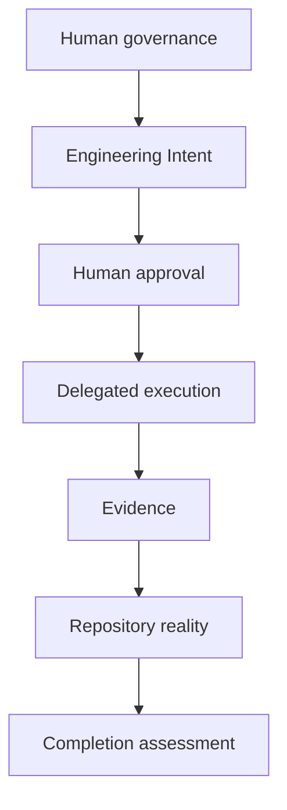
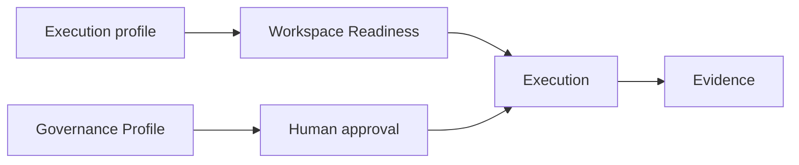
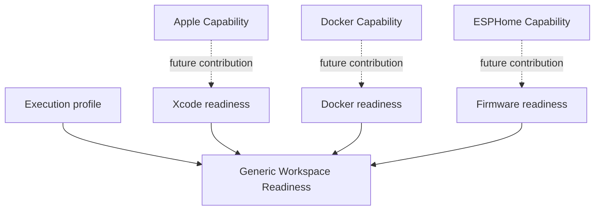
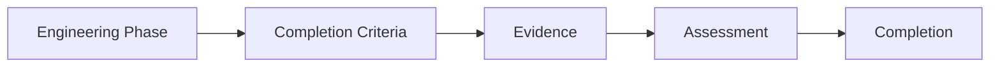
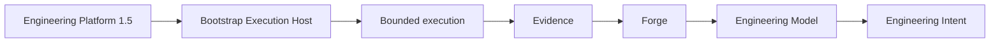

# Forge Governance Model

## Purpose and authority

This document is Forge's canonical conceptual Governance Model captured during
bootstrap. It explains how human decision authority, delegated engineering,
approval, evidence, and phase completion relate. It elaborates the [Forge
Constitution](01_CONSTITUTION.md), [Forge Engineering
Model](05_ENGINEERING_MODEL.md), and [Forge Knowledge
Model](06_KNOWLEDGE_MODEL.md); those records retain their respective
authority.

This capture records bootstrap knowledge only. It does not implement approval
workflows, authentication, roles, access control, a runtime, repository
operations, or a reporting system.

## Governance philosophy

**Context.** Forge performs engineering in environments that may contain AI
and other automated assistance, while engineering still changes products and
repositories for which people are accountable.

**Responsibility.** Humans retain governance and accountability. Forge may
support engineering; AI may support Forge; neither becomes the authority that
defines or approves engineering.

**Rationale.** Separating execution from governance makes a capable execution
environment useful without allowing availability, automation, or generated
output to become implicit authorization. Repository evidence remains
authoritative for what engineering actually produced.

**Relationships.** This applies Constitution Articles 1, 5, and 6 to the
Engineering Intent, Approval, Execution, Evidence, and Knowledge Evolution
chain.

**Constraints.** Forge does not self-authorize, and AI does not assume human
accountability. A prompt, proposal, lifecycle label, report, or successful
execution does not supersede repository evidence or grant approval.

**Future evolution.** Future governance capabilities may represent decisions
and delegations, but must preserve human authority and repository-first
assessment.

## Human governance

**Context.** Forge needs a durable boundary between product and architectural
decisions and the assistance used to perform bounded work.

**Responsibility.** Humans define Vision, Architecture, Constitution,
Governance, and Approvals. Forge may analyse, plan, propose, and execute only
within explicitly delegated authority, declared scope, constraints, and
expected evidence.

**Rationale.** These enduring concerns set the meaning and legitimacy of
engineering. Delegating their authority to an execution system would collapse
direction, authorization, and implementation into one unaccountable action.

**Relationships.** Human governance constrains Engineering Intent and
Approval. Execution Hosts and Runtime Providers consume approved work but do
not own its meaning. Evidence permits humans to assess outcomes.

**Constraints.** A delegation is bounded; it does not alter Vision,
Architecture, Constitution, or Governance. Forge cannot broaden a delegation,
approve its own proposal, or infer authority from a selected profile.

**Future evolution.** Future governance work may make delegation and approval
more explicit while keeping the human decision boundary independent from
execution.

## Governance profiles

**Context.** Different workspaces need to describe how human decision
authority is organized without confusing that organization with engineering
execution.

**Responsibility.** A Governance Profile declares the human-governance context
for a Workspace. The established catalog is `solo`, `two_person`, `team`, and
`enterprise`; bootstrap activates `solo` only.

**Rationale.** A catalog preserves a common vocabulary for growing governance
needs while avoiding an implementation-specific authorization system.

**Relationships.** A Workspace selects one Governance Profile independently
of its Engineering Mode and execution profile. The selection informs the
expected human approval model for an Engineering Intent; it grants no runtime
authority.

**Constraints.** Profiles do not implement identities, RBAC, voting, queues,
or approval mechanics. A profile value is not approval, and the inactive
profiles do not imply a current organizational design.

**Future evolution.** A separately governed capability may qualify the
profile catalog with explicit, evidence-backed decision practices without
changing its independence from execution.

| Profile | Purpose | Human responsibility boundary | Expected approval model |
| --- | --- | --- | --- |
| Solo | One accountable human governs a Workspace. | The accountable human defines direction and approves delegated work. | Explicit human approval remains required; no system self-approval. |
| Two Person | A Workspace needs human governance shared by two people. | Humans explicitly allocate decision and review responsibility for the bounded work. | Approval remains human and explicit; the allocation must be clear before execution. |
| Team | A Workspace needs governance across a collaborating group. | The group maintains explicit ownership of direction, architecture, and approvals. | Approval follows the declared human ownership for the work; execution does not choose it. |
| Enterprise | A Workspace needs governance compatible with an organizational context. | Accountable humans retain decisions within the organization's declared governance boundary. | Approval remains explicit and human-governed; this capture defines no enterprise process. |

## Execution modes and profiles

**Context.** Bootstrap distinguished the context in which engineering runs
from the people who decide whether it may run.

**Responsibility.** Execution Modes define engineering execution. Governance
Profiles define decision authority. They are independent concepts.

**Rationale.** The same human-governance profile can govern different
execution contexts, and a change of execution context must not silently
change who decides or approves work.

**Relationships.** Bootstrap establishes Genesis as a local bootstrap
execution profile and Managed Readiness as a future profile boundary. The
workspace schema separately carries the persisted Engineering Mode catalog:
`prototype`, `managed`, `production`, and `enterprise`.

**Constraints.** This document does not rename or replace the schema catalog.
The requested execution vocabulary—Genesis, Managed, Production, and
Enterprise—describes execution profiles conceptually; no mapping to persisted
Engineering Mode values is defined here. Selecting either kind of value grants
no authority.

**Future evolution.** A future governed increment may reconcile a durable
execution-profile contract with the existing schema only through explicit
intent, evidence, review, and approval.

| Execution profile | Purpose | Governance boundary |
| --- | --- | --- |
| Genesis | Bootstrap execution against a local, independent Forge repository. | Requires a bounded local transaction and objective local Git evidence; no upstream remote or pull request is required. |
| Managed | Governed engineering where repository and human-governance checks are managed explicitly. | The profile boundary exists; its checks and runtime remain separately governed work. |
| Production | A conceptual profile for production engineering execution. | No runtime, readiness contract, or approval implementation is established by this capture. |
| Enterprise | A conceptual profile for enterprise-context execution. | No runtime, readiness contract, or approval implementation is established by this capture. |

## Workspace readiness

**Context.** A Workspace needs a generic way to assess whether it is prepared
to enter a declared execution profile, distinct from assessing whether a phase
has completed.

**Responsibility.** Workspace Readiness provides the common assessment model.
Execution profiles contribute readiness checks, and capabilities may contribute
additional declared checks with their required evidence and assessment rules.

**Rationale.** Readiness is capability-driven because a runtime name alone
cannot establish the actual prerequisites of a capability. This preserves one
generic assessment model while allowing relevant, declared capabilities to add
their own evidence needs.

**Relationships.** Genesis Readiness is the established bootstrap example.
Capability contributions remain declarative and use repository evidence for
repository reality. Phase Completion evaluates bounded outcomes only after
work, whereas readiness determines whether work may begin.

**Constraints.** No readiness runtime, capability qualification process, or
capability-specific checks are implemented here. Apple/Xcode, Docker, and
ESPHome/firmware examples illustrate the contribution shape only; Forge has
not declared those capability-readiness contracts.

**Future evolution.** Once separately authorized and evidenced, a capability
may contribute checks such as Apple Capability to Xcode readiness, Docker
Capability to Docker readiness, or ESPHome Capability to firmware readiness,
without replacing the common model.

## Evidence and phase completion

**Context.** Bootstrap established that execution can produce an apparently
successful result without demonstrating that declared completion criteria are
met.

**Responsibility.** An engineering phase completes only through an assessment
of evidence against its declared completion criteria. Repository evidence is
mandatory wherever repository reality is relevant.

**Rationale.** This model was introduced to make completion reproducible and
to prevent opinion, a closure statement, or successful execution alone from
closing a phase.

**Relationships.** Engineering Intent declares expected evidence and
validation. Execution produces evidence. Assessment determines completion and
can inform Knowledge Evolution; readiness remains a distinct pre-execution
assessment.

**Constraints.** Evidence does not approve work, rewrite an Intent, or create
new scope. A phase is not complete because a runtime reports success or a
reviewer recommends closure.

**Future evolution.** Future evidence capabilities may improve references and
reproducibility while retaining the same evidence-first completion boundary.

## Repository truth

**Context.** Engineering accounts can conflict with the observable repository
state.

**Responsibility.** Repository evidence always outranks reviewer observations,
conversations, reports, and assumptions when assessing repository reality.

**Rationale.** The repository contains the implemented state and the evidence
needed to assess it; other accounts may be stale, incomplete, or mistaken.

**Relationships.** Repository Truth realizes Constitution Article 1 and
grounds Phase Completion, Architecture Drift, Workspace Readiness, and
Knowledge Evolution.

**Constraints.** Repository Truth does not make repository contents a source
of approval or a redefinition of Engineering Intent. It settles what is
observable, not what humans should decide next.

**Future evolution.** Future evidence capture may make repository references
more structured, but cannot lower repository evidence beneath commentary or
reports.

## Reviewer model

**Context.** Review supplies valuable analysis without itself changing the
implemented state.

**Responsibility.** Reviewers analyse and recommend. They contribute advisory
observations that can focus assessment or suggest follow-up work.

**Rationale.** Treating a reviewer statement as engineering truth would allow
an observation to override observable implementation evidence and undermine
reproducible assessment.

**Relationships.** Reviewer observations may inform Evidence assessment and
future Proposals, but repository evidence remains authoritative for Repository
Reality and phase completion.

**Constraints.** Reviewers never become engineering truth. A recommendation
does not approve work, complete a phase, redefine Intent, or override a
conflicting repository fact.

**Future evolution.** Future review capabilities may improve analysis and
traceability while retaining advisory status and repository-first authority.

## Engineering reports

**Context.** Engineering needs readable decision support without allowing a
report to replace the repository as the source of truth.

**Responsibility.** Engineering Reports distinguish five lenses: Initial
Repository Assessment, Engineering Outcome, Reviewer Findings, Repository
Truth, and Management Summary.

**Rationale.** Separating these lenses prevents a preliminary observation,
execution narrative, or reviewer recommendation from being mistaken for the
observable result. A report can explain assessment without becoming the
implementation evidence it describes.

**Relationships.** Initial Repository Assessment establishes the observed
starting context; Engineering Outcome explains the bounded result; Reviewer
Findings remain advisory; Repository Truth records the authoritative observed
state; and Management Summary communicates decision-relevant context. All are
assessed against relevant repository evidence.

**Constraints.** Reports neither implement work nor grant authority. Reviewer
observations inside a report may never override implementation evidence, and a
Management Summary cannot select or approve work by implication.

**Future evolution.** Future reporting capabilities may provide structured
forms for these distinctions, but must preserve evidence references and the
authority of Repository Truth.

## Bootstrap governance

**Context.** Forge bootstrap needs an execution environment before Forge owns
its future runtime, yet the execution environment must not become Forge's
engineering authority or knowledge owner.

**Responsibility.** Engineering Platform 1.5 is the temporary Bootstrap
Execution Host. Forge owns its Engineering Model and engineering knowledge.

**Rationale.** The separation allows bounded bootstrap execution while
preserving Forge's runtime independence and preventing a temporary host from
defining permanent engineering knowledge.

**Relationships.** Engineering Platform 1.5 executes through the Bootstrap
Execution Host boundary; Forge retains the Engineering Model, Intent,
governance, evidence, and knowledge boundaries. Genesis remains an execution
profile, not host-owned product architecture.

**Constraints.** Bootstrap does not make Engineering Platform 1.5 a Forge
runtime dependency, source of approval, or owner of repository truth.

**Future evolution.** Future Forge Runtime and execution-host contracts
require separately governed, evidenced capabilities that preserve this
separation.

## Future governance

**Context.** Bootstrap identified governance boundaries that require future
realization but deliberately did not implement them.

**Responsibility.** Phase Completion, Engineering Intent approval, Knowledge
Reconciliation, Capability qualification, and Architecture stewardship remain
future governed concepts.

**Rationale.** Naming the established boundaries preserves a coherent path
without turning a conceptual capture into runtime, authorization, or
organizational implementation.

**Relationships.** Phase Completion depends on evidence; Engineering Intent
approval preserves human governance; Knowledge Reconciliation and Architecture
stewardship preserve repository-held knowledge; Capability qualification can
contribute declared, evidence-based behavior such as readiness checks.

**Constraints.** These concepts do not create automatic approval, a new
governance profile, capability behavior, repository mutation, or scope. Their
realization requires separate intent, approval, implementation, and evidence.

**Future evolution.** Each concept may evolve only through a bounded,
governed capability that preserves the Constitution, Engineering Model,
Knowledge Model, human accountability, and repository-first truth.
