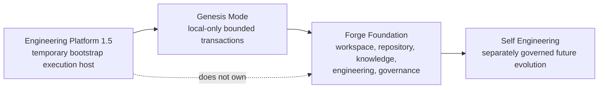
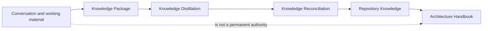
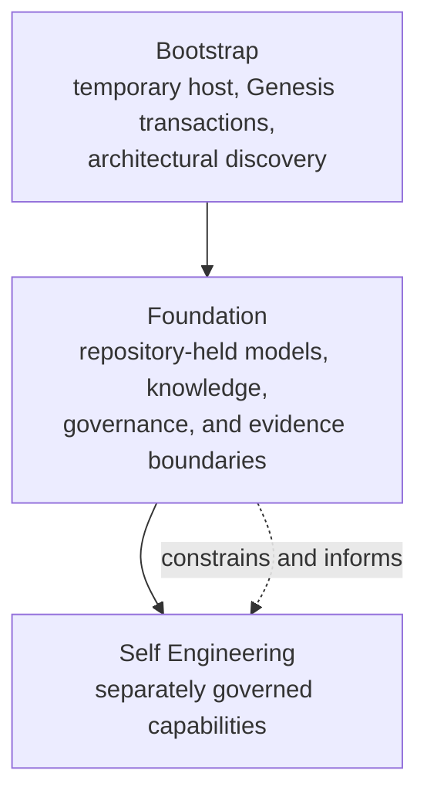

# Forge Bootstrap History

## Purpose and authority

This chapter is the canonical historical record of how Forge's bootstrap
architecture emerged. It records architectural discoveries evidenced by the
Foundation commits and the completed Bootstrap Knowledge Package. It does not
replace the [Constitution](01_CONSTITUTION.md), [Core
Architecture](03_ARCHITECTURE.md), [Engineering Model](05_ENGINEERING_MODEL.md),
[Knowledge Model](06_KNOWLEDGE_MODEL.md), or [Governance
Model](07_GOVERNANCE.md). Those chapters remain the authority for the current
architecture.

This is architectural history, not implementation documentation. Commit names
are used only to anchor the sequence of discoveries; this chapter does not turn
the bootstrap implementation into a continuing runtime commitment.

## Reading the history

Forge did not begin with a complete architecture that was then mechanically
implemented. It began with a bounded local foundation and accumulated evidence
about the distinctions a durable engineering product required. Each phase
below records the context, discovery, decision, rationale, and consequences
of that evidence.



## Phase 0 — Engineering Platform 1.5

### Context

Engineering Platform already existed when Forge bootstrap started. Forge needed
a deterministic means to execute bounded engineering transactions before it
had any Forge-owned runtime or execution capability.

### Discovery

Bootstrap activity needs an execution host, but an execution host is not
therefore the owner of a product's identity, engineering meaning, knowledge,
or governance.

### Decision

Engineering Platform 1.5 became the temporary Bootstrap Execution Host. Forge
reused that existing platform rather than creating another runner for the
bootstrap effort.

### Rationale

Reusing the established execution environment avoided making runner creation a
precondition for the architectural work. It also kept the bootstrap scope
local and deterministic while preserving a clear boundary between temporary
transport and the product being founded.

### Consequences

Engineering Platform executed the bounded Genesis transactions, but it did not
become a Forge Runtime Provider, a Forge-owned execution host, or the source
of Forge architecture. Future Forge-owned runtime and execution capabilities
remain separately governed work.

## Phase 1 — Greenfield Bootstrap

### Context

Forge began as a greenfield foundation rather than an adopted repository with
an existing remote operating history. It needed a way to create durable local
repository evidence without assuming GitHub or an upstream branch.

### Discovery

The bootstrap environment required a valid engineering mode for greenfield,
local-only repositories. The normal assumptions of a remote-backed repository
would have made foundational work depend on infrastructure that did not yet
belong to the product.

### Decision

Genesis Mode was introduced for bounded local-only transactions: work occurred
in greenfield local repositories and was reconciled by clean local commits,
without requiring a GitHub remote or pull request.

### Rationale

Genesis made repository evidence available from the first increment while
preserving the distinction between local foundational work and a later
remote-governed operating model. It was a bootstrap execution profile, not a
claim that every Forge repository must remain local-only.

### Consequences

The first foundation commits could establish a Workspace Foundation and then a
Foundation Model with reproducible local history. The architectural outcome
could be captured in a repository without inventing a remote service, runner,
or collaboration model.

## Phase 2 — Foundation Discovery

### Context

The initial Workspace Foundation established that Forge was about more than a
single code repository. The subsequent Foundation Model had to make that
understanding explicit without introducing repository operation.

### Discovery

Bootstrap established several separate concerns:

- a **Workspace** represents the product boundary;
- a **Repository** is an engineering and evidence boundary within that product;
- a **Capability** is a bounded unit of evolution rather than an implied
  implementation;
- **Knowledge** requires source, authority, and lifecycle boundaries;
- **Governance** retains human authority over progression; and
- an **Engineering Model** must keep planning, work definition, execution, and
  evidence distinct.

The Foundation Model, Foundation Document Loader, and Knowledge Consumption
increments confirmed that these could be represented locally and
deterministically without cloning, operating, or mutating external sources.

### Decision

Forge adopted a Workspace-first product model and a Repository-first
engineering/evidence model. It made capability, knowledge, governance, and
engineering first-class architectural layers rather than attributes of a
single runner or prompt.

### Rationale

Treating a product as one repository would lose product context in a
multi-repository future. Treating a repository as the product would also blur
the boundary between product identity and observable engineering reality.
Separate layers made their authorities, inputs, and non-goals inspectable.

### Consequences

Foundation could be local, declarative, versioned, and deterministic. It did
not establish repository discovery, Git operations, remote knowledge
retrieval, semantic synthesis, runtime execution, or automatic approval.
These absences are architectural constraints, not missing implementation
details.

## Phase 3 — Engineering Discovery

### Context

Planning, Proposal Generation, and Prompt Artifact work made the original
bootstrap engineering path visible. The early Prompt Artifact was useful as a
versioned, provider-neutral instruction representation, but its role exposed a
deeper question: what is the stable meaning of an engineering change when its
execution representation changes?

### Discovery

The bootstrap sequence distinguished:

- a **Proposal**, which bounds and justifies candidate work but does not
  authorize it;
- an **Engineering Intent**, which is the durable, model-independent statement
  of bounded engineering work;
- a **Runtime Provider**, which may consume a derived representation but is not
  the source of meaning;
- a **Runtime Prompt**, which is a temporary provider-specific execution
  artefact; and
- an **Execution Host**, which supplies an execution environment without
  owning the work's architecture or governance.

### Decision

Engineering Intent replaced Prompt Artifact as the canonical engineering
concept. Prompt Artifact was retained as a compatible transitional bootstrap
representation. Runtime Prompts were defined as future derived
provider-specific artefacts, and Runtime Providers as future governed
consumers of them.

### Rationale

A prompt is shaped by the provider and the transport used to execute it. It
cannot be the stable source for what the work means or for measuring
Repository Drift. A canonical Intent keeps the work definition independent of
provider formatting, while a provider and its host remain accountable only for
their execution responsibilities.

### Consequences

The engineering chain became:

```text
Knowledge → Planning → Proposal → Engineering Intent → Runtime Provider
→ Runtime Prompt → Execution → Evidence
```

Bootstrap did not implement persistence, parsing, migration, Runtime
Providers, a Mission Runtime, or execution. The retained Prompt Artifact did
not become input to a Runtime Prompt and did not determine Repository Drift.

## Phase 4 — Knowledge Discovery

### Context

Bootstrap itself produced discussions, prompts, documents, reports, and local
evidence. A durable product could not make the temporary conversations that
produced that material a permanent architectural dependency.

### Discovery

The Knowledge Consumption foundation and subsequent bootstrap capture
established that source declarations and evidence references preserve useful
context without transferring source authority. From that boundary emerged
Knowledge Packages, Knowledge Distillation, Knowledge Reconciliation, and the
Architecture Handbook as distinct concepts.

### Decision

Forge made repository-held, reconciled knowledge the durable basis for future
architecture. A Bootstrap Knowledge Package captures bootstrap understanding;
Knowledge Distillation identifies reusable candidates; Knowledge Reconciliation
requires architectural judgment before repository knowledge changes; and an
Architecture Handbook is maintained from reconciled repository knowledge.

### Rationale

Conversations are ephemeral, provider-dependent, and not inherently
reviewable as product architecture. Permanently depending on them would make
future engineering require unavailable context and would silently transfer
authority to a past interaction.

### Consequences

The durable knowledge path became:



Neither Distillation nor Reconciliation automatically transfers authority,
changes repository knowledge, or authorizes implementation. The repository
became the long-term owner of architecture that survives bootstrap.

## Phase 5 — Governance Discovery

### Context

Local deterministic implementation and a clean commit were necessary
bootstrap facts, but they were not enough to state whether a Workspace could
begin work or whether a phase was complete.

### Discovery

Bootstrap separated:

- **Workspace Readiness**, an assessment of whether a Workspace is prepared
  for a declared execution profile;
- **Phase Completion**, an assessment of declared criteria using reproducible
  evidence and an explicit completion declaration;
- **Repository Truth**, the observable repository reality used for assessment;
- **Execution Modes** and **Governance Profiles**, which describe operating
  context and human-authority shape without granting approval themselves.

### Decision

Forge adopted evidence-first governance. Readiness and completion were made
different assessments, while execution mode and governance profile remained
declarative context. Repository truth and reproducible evidence became the
governing basis for assessment; human governance remained responsible for
approval and progression.

### Rationale

An execution profile, a statement of completion, or a successful run cannot
independently prove that prerequisites or criteria were satisfied. Separating
those claims prevents execution from granting itself authority.

### Consequences

The Phase Completion Framework could assess declared criteria from supplied
reproducible evidence without fetching evidence, orchestrating work, operating
repositories, or granting authority. Governance gained a stable evidence
boundary without creating a self-authorizing runtime.

## Phase 6 — Bootstrap Repairs

### Context

The original Foundation increments exposed issues in the Foundation Document
Loader reporting, Engineering Proposal Generator, and Engineering Prompt
Artifact foundation. These were repaired before Bootstrap Phase A was closed.

### Discovery

Bootstrap artifacts can be architecturally correct in direction yet need
targeted reconciliation when their observed behavior or reporting does not
match the intended foundation boundary. Replaying every earlier increment
would obscure the evidence path and risk rewriting the history that made the
issue visible.

### Decision

Forge used bounded repair increments and retained them as additions to the
history. Repairs were preferred over replaying bootstrap increments. Repair
reports became a recognized evidence kind for future phase assessment, while a
separate Repair Engineering capability was not asserted by bootstrap.

### Rationale

Append-only repair preserves the original architectural decision, the observed
gap, the reconciliation, and the resulting repository truth. This is more
auditable than pretending the earlier increment had always contained the final
state.

### Consequences

The repaired outcomes were included in the Phase A closure rather than treated
as independent runtime capabilities. Repair became an architectural capability
in the narrow sense that the architecture now has an evidence-aware,
append-only way to reconcile bounded implementation defects; it did not create
an autonomous repair system or authorize automatic change.

## Phase 7 — Architecture Discoveries and Pivots

### Context

Bootstrap began with useful local foundation mechanisms, but their completed
sequence showed that several original framings had conflated product identity,
engineering meaning, execution, knowledge, and governance.

### Discovery

The material discoveries were connected rather than isolated: Workspace and
Repository needed separate ownership; Intent needed to outlast prompts;
knowledge needed reconciliation; and readiness, completion, and execution
needed different evidence and authority boundaries.

### Decision

Forge recorded those discoveries as architectural pivots in the Constitution,
Foundation Model, Engineering Model, Knowledge Model, Governance Model, and
the Bootstrap Knowledge Package.

### Rationale

Naming the pivots makes the reasons for the current architecture inspectable.
It prevents future work from restoring an earlier, narrower assumption merely
because a bootstrap mechanism remains compatible.

### Consequences

The following pivots summarize the material changes in architectural framing
that bootstrap evidence produced. They are not a feature list.

| Original assumption | Discovery | Architectural decision | Consequences |
| --- | --- | --- | --- |
| A repository could stand for the product. | Product meaning can span repositories, while repository state is still the best engineering evidence boundary. | Workspace-first product identity with repository-first engineering and evidence. | Repository roles became explicit; a Workspace did not become a repository operator. |
| A prompt artifact could carry the engineering instruction. | A prompt changes with provider and transport. | Engineering Intent became canonical; Prompt Artifact remained transitional. | Drift compares Intent with Repository Reality, not a prompt with repository content. |
| A runner might define the engineering flow. | Execution environment, provider, and work definition have distinct authorities. | Runtime Provider and Execution Host became separate concepts. | Engineering Platform remained temporary; no Forge-owned runtime was claimed. |
| Captured source material could be treated as knowledge. | Source identity, trust, lifecycle, and reconciliation matter. | Knowledge Distillation and Knowledge Reconciliation became explicit. | Conversations and working material cannot silently become repository architecture. |
| A successful bootstrap run could imply readiness or closure. | Prerequisites, passing criteria, and human closure are distinct claims. | Workspace Readiness and Phase Completion became distinct evidence assessments. | Evidence, not execution success alone, governs readiness and completion. |
| Product naming and runtime naming could be treated as the same concern. | Public Product Identity needs its own governed boundary. | Product Identity remained distinct from runtime names and execution mechanisms. | A runtime name cannot silently become an architectural product concept. |
| One operating shape could fit every repository lifecycle. | Bootstrap and later operation need explicit constraints. | Genesis and later execution profiles/modes were modeled as declarative context. | Local-only bootstrap did not become a universal operating rule. |
| Architecture could remain stable once initially written. | Bootstrap implementation revealed material distinctions after initial documents existed. | Architecture Drift became a governed comparison of Intent and Repository Reality. | Evolution is assessed against durable intent and evidence, not informal memory. |

## Chronological timeline

| Milestone | Architectural significance |
| --- | --- |
| **Foundation 0.1 — Workspace Foundation** | Established the product-level Workspace boundary and local deterministic starting point. |
| **Foundation 0.2 — Foundation Model** | Separated Workspace, Repository, Capability, Knowledge Source, Engineering Mode, and Governance Profile. |
| **Foundation 0.3 — Foundation Document Loader** | Confirmed repository-held foundation documents as deterministic, local inputs. |
| **Foundation 0.4 — Knowledge Consumption** | Established declared, read-only knowledge-source consumption and evidence references. |
| **Foundation 0.5 — Engineering Planning** | Made bounded planning and evidence references explicit without execution authority. |
| **Foundation 0.6 — Engineering Proposal Generator** | Distinguished a justified candidate proposal from approval and execution. |
| **Foundation 0.7 — Prompt Artifact** | Introduced a versioned transitional instruction representation. |
| **Foundation 0.8 — Engineering Intent** | Pivoted canonical engineering meaning from Prompt Artifact to Engineering Intent. |
| **Bootstrap repairs** | Reconciled loader reporting, proposal generation, and prompt-artifact behavior through append-only repair increments. |
| **Phase A closure** | Recorded the completed local foundation and its explicit non-goals. |
| **Phase Completion Framework** | Made reproducible evidence and explicit closure assessable without execution authority. |
| **Bootstrap Knowledge Package** | Consolidated the discovered architecture into repository-owned knowledge for the transition to Foundation and Self Engineering. |

## Bootstrap philosophy

Bootstrap deliberately allowed architecture to evolve. The foundation was not
treated as a prewritten specification awaiting implementation; engineering
produced evidence that revealed the distinctions the architecture needed.

That philosophy has four durable implications:

- **Architecture was discovered.** The model changed when bootstrap evidence
  showed that an earlier representation was too narrow or conflated authority.
- **Evolution was intentional.** Greenfield Genesis transactions provided a
  controlled way to learn without presenting provisional mechanisms as final
  architecture.
- **Engineering produced architectural knowledge.** Planning, proposals,
  artifacts, repairs, and closure reports supplied context for reconciliation,
  not automatic authority.
- **The repository became the long-term owner.** Architecture survives the
  temporary host, provider prompts, and conversations only after it is captured
  and reconciled in repository knowledge.

This differs from a traditional project model in which architecture is assumed
to be settled before implementation begins and implementation is expected only
to conform. Forge bootstrap treated implementation as bounded architectural
research under evidence and human governance, then captured the resulting
stable distinctions without promoting the bootstrap transport into product
authority.

## Transition — Bootstrap to Foundation to Self Engineering

Bootstrap exists as a milestone because it creates the conditions for Forge to
engineer itself without allowing self-engineering to define its own meaning.



Bootstrap supplied the evidence and vocabulary. Foundation preserves them as
the durable base. Self Engineering is the next architectural direction in
which Forge may realize bounded capabilities—such as intent lifecycle,
knowledge reconciliation, runtime-provider work, and qualification—only
through separately governed, evidenced increments. It is not established by
this history as an autonomous runtime, execution host, cloud service, Studio,
or multi-user governance implementation.

## Knowledge Capture Report

### Outcome

This capture records the historical evolution from the temporary Engineering
Platform 1.5 host through Genesis Mode, Foundation discovery, engineering and
knowledge pivots, governance boundaries, repairs, and Phase A closure. The
historical record is consistent with the Bootstrap Knowledge Package and keeps
its authority boundaries intact.

### Boundaries preserved

No prior Bootstrap Knowledge Capture document was modified. This chapter does
not assert new capabilities, redesign bootstrap history, or convert a future
runtime/provider direction into implemented behavior.

### Historical next recommendation

At the closure point of this history capture, the recommended next Knowledge
Capture increment was **Forge Knowledge Capture 010 — Capability Catalogue**.
Repository history records that the Capability Catalogue was subsequently
captured as [Chapter 09](09_CAPABILITIES.md); this historical recommendation
does not select present work or override current repository planning.
