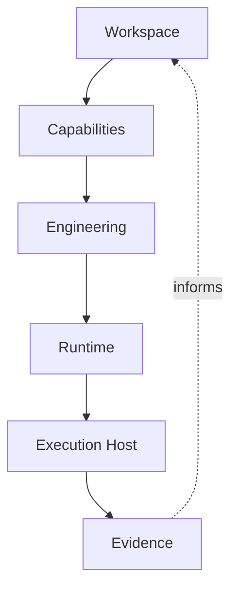
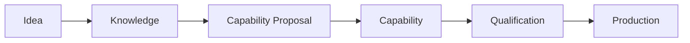
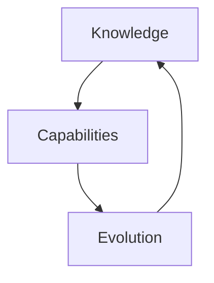
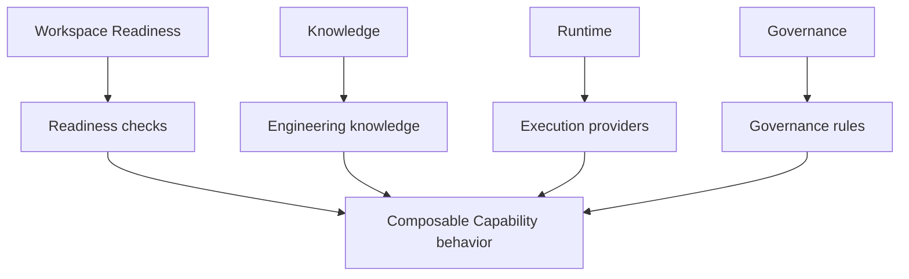

# Forge Capability Catalogue

## Purpose and authority

This catalogue captures the canonical Capability Model discovered during Forge
bootstrap. It elaborates [Constitution Article 7](01_CONSTITUTION.md#article-7--capability-first-evolution) and remains consistent with the [Core
Architecture](03_ARCHITECTURE.md), [Workspace & Repository Model](04_WORKSPACE_REPOSITORY.md), [Engineering Model](05_ENGINEERING_MODEL.md), [Knowledge
Model](06_KNOWLEDGE_MODEL.md), and [Governance Model](07_GOVERNANCE.md). Those
documents retain their authority.

This is conceptual architecture, not implementation documentation. It records
only bootstrap concepts. A catalogue entry is not an implemented Capability,
an authorization, a runtime contract, or a delivery commitment.

## Capability philosophy

**Context.** Forge needs to grow without treating every documented direction,
runtime name, or adjacent tool as delivered behavior.

**Responsibility.** A Capability is a bounded, reusable unit through which
Forge may add engineering behavior. It has an explicit responsibility and
non-goals, a stable identity, a versioned declaration, and a relationship to
the Workspace that owns its product meaning.

**Rationale.** Explicit boundaries allow independently useful behavior to
evolve without collapsing product direction, human authority, repository
evidence, and execution into one mechanism. They make the platform's possible
growth discoverable and composable while keeping each change governable.

**Relationships.** The Workspace supplies product context. Knowledge informs
what a Capability means; Engineering Intent bounds work to realize it;
Governance authorizes progression; Runtime and Execution Hosts may realize
approved behavior; repository evidence qualifies observable outcomes.

**Constraints.** Capabilities are versioned, discoverable, composable, and
independently evolvable, but none of those properties imply installation,
execution, approval, or automatic compatibility. Bootstrap's existing schema
boundary is `declared`: a documented concept does not become an implemented
Capability automatically.

**Future evolution.** A separately bounded, governed, and evidenced increment
may realize a declared Capability while preserving its responsibility,
non-goals, repository-first evidence, human governance, and runtime
independence.

## Capability lifecycle

**Context.** A concept needs a path from a discovery to trustworthy use without
mistaking discovery or successful execution for qualification.

**Responsibility.** The bootstrap lifecycle distinguishes the following
conceptual stages:

| Stage | Conceptual meaning |
| --- | --- |
| Idea | A possible capability direction discovered in conversation, architecture, assessment, or product thinking. It has no authority or behavior. |
| Knowledge | Reviewed, repository-held understanding that gives an idea context, rationale, constraints, and relationships. |
| Capability Proposal | A bounded suggestion for a Capability's responsibility, non-goals, dependencies, and expected evidence. It does not authorize implementation. |
| Capability | The explicitly declared, versioned, discoverable unit of platform evolution. At bootstrap, declaration does not claim runtime realization. |
| Qualification | Capability-specific assessment of declared criteria and evidence. Qualification establishes evidence, not self-approval. |
| Production | A future governed operating state reached only after separate authorization and qualification; it is not established by this catalogue. |

**Rationale.** The stages separate possible work from durable knowledge,
declared responsibility, assessment, and operating trust.

**Relationships.** Knowledge Distillation and Reconciliation can move an Idea
into reviewed Knowledge. Planning, Proposal, Engineering Intent, and Approval
bound realization. Qualification relies on Evidence and repository reality.

**Constraints.** The lifecycle is not a runtime workflow, queue, release
process, or approval implementation. No transition occurs merely because a
document, prompt, report, or runtime output names it.

**Future evolution.** Future capabilities may make individual transitions
more explicit, provided they preserve human authority and evidence-first
assessment.

## Categories and composition

**Context.** Bootstrap identified Capability concepts across several product
layers without making a single category a replacement for the others.

**Responsibility.** The established categories are Workspace, Knowledge,
Governance, Engineering, Runtime, Documentation, Architecture, Platform,
Readiness, Identity, and Execution. They are a vocabulary for locating
responsibilities, not a catalog of implemented modules.

**Rationale.** Categories make related responsibilities discoverable while
allowing a Capability to remain narrow and independently evolvable.

**Relationships.** A Capability may span explicit dependencies among
Knowledge, Governance, Workspace, Engineering, and Runtime. The dependency
states what it needs; it does not merge ownership or lifecycle with another
Capability.

**Constraints.** Dependencies are explicit. A Capability must not infer a
dependency from a runtime name, Workspace role, or adjacent concept; it does
not inherit authority from its category.

**Future evolution.** Future declarations may publish dependency and
compatibility information without prescribing an installation mechanism.

## Workspace Capabilities

### Workspace Readiness

**Context.** A Workspace must establish whether it is prepared to enter a
declared execution profile before work begins.

**Responsibility.** Workspace Readiness supplies the generic assessment model;
profiles declare checks, evidence, and assessment rules.

**Rationale.** A runtime name alone cannot prove prerequisites. A common model
permits relevant Capabilities to contribute declared checks.

**Relationships.** Genesis Readiness is the established bootstrap example.
Capabilities may contribute readiness checks; Governance and execution
profiles provide the assessment context; repository evidence remains
authoritative for repository reality.

**Constraints.** It is distinct from Phase Completion and does not execute
work. No readiness runtime or capability-specific check is implemented.

**Future evolution.** Future Capability contributions may extend declared
checks without replacing the common readiness model.

### Workspace Adoption

**Context.** An existing product may need to enter the Forge Workspace model.

**Responsibility.** Workspace Adoption is the conceptual boundary for
importing repository references, selecting a Canonical Repository, and
discovering relevant engineering context.

**Rationale.** It keeps product understanding coherent while recognizing that
an adopted product did not begin as a Forge Workspace.

**Relationships.** It relies on the Workspace and Repository Catalog model,
Knowledge Import, Architecture, Governance, and repository evidence.

**Constraints.** It does not discover, clone, inspect, mutate, or operate
repositories, and documentation of it creates no adoption behavior.

**Future evolution.** A bounded Capability may provide declarative adoption
support while retaining Workspace ownership and repository independence.

### Repository Extraction

**Context.** Product meaning must survive repository distribution or a change
in implementation topology.

**Responsibility.** Repository Extraction is the conceptual boundary for
separating repository contributions while preserving their Workspace context.

**Rationale.** It prevents repository topology from redefining product
identity, architecture, governance, or evidence ownership.

**Relationships.** It uses the Repository Catalog, including canonical,
supporting, documentation, and capability roles, and depends on Workspace
knowledge and governance.

**Constraints.** It is not a Git, migration, cloning, or repository-operations
capability in this capture.

**Future evolution.** A future bounded realization may describe extraction
evidence and relationships without turning the Workspace into a repository
operator.

### Workspace Templates

**Context.** Bootstrap identified a need for reusable Workspace structure
without substituting a template for a product's actual context.

**Responsibility.** Workspace Templates provide a conceptual reusable shape
for Workspace understanding.

**Rationale.** Reuse can improve consistency while preserving explicit
Workspace identity, architecture, repository roles, and governance.

**Relationships.** Templates relate to Workspace Adoption, Repository Catalog
structure, Documentation, Architecture, and Knowledge.

**Constraints.** A template neither creates a Workspace nor authorizes,
executes, or mutates repositories.

**Future evolution.** Future declarative template capabilities may evolve
independently from runtime or repository operations.

### Workspace Overlays

**Context.** A Workspace can require additional context without changing its
base product boundary.

**Responsibility.** Workspace Overlays are the conceptual means of expressing
such additive Workspace context.

**Rationale.** An overlay preserves a coherent base model while allowing
bounded concerns to remain separately identifiable.

**Relationships.** Overlays relate to Templates, Architecture, Governance,
Knowledge, and declared Capability dependencies.

**Constraints.** An overlay does not silently rewrite canonical Workspace
meaning, create authority, or implement runtime behavior.

**Future evolution.** Any overlay mechanism requires separate bounded design,
governance, and evidence.

## Knowledge Capabilities

### Knowledge Distillation

**Context.** Conversations and observations can contain useful discoveries but
are not durable product knowledge.

**Responsibility.** Knowledge Distillation identifies Knowledge Candidates
from input while retaining their source and uncertainty.

**Rationale.** It creates a path from discovery to reusable understanding
without making unreviewed material authoritative.

**Relationships.** Candidates proceed to Knowledge Reconciliation, Repository
Context, Architecture Stewardship, and potentially Knowledge Evolution.

**Constraints.** It does not automatically write, approve, or reconcile
knowledge; prompts, transcripts, and runtime output remain non-authoritative.

**Future evolution.** A future capability may make distillation reproducible
while retaining review and repository-first authority.

### Knowledge Reconciliation

**Context.** A candidate must be compared with current repository knowledge
before it can affect architecture or engineering.

**Responsibility.** Knowledge Reconciliation reviews candidates against
repository context and records assessed outcomes.

**Rationale.** Comparison prevents stale, conflicting, or ungrounded material
from becoming architectural truth.

**Relationships.** It follows Distillation and informs Architecture Steward,
Architecture Handbook Evolution, Glossary, and Engineering Intent authoring.

**Constraints.** It neither grants authority nor overrides repository evidence
or constitutional principles.

**Future evolution.** A separately governed capability may formalize review
while retaining human architectural judgment.

### Knowledge Import

**Context.** Bootstrap Knowledge Packages and external Knowledge Sources
provide starting evidence for a Workspace.

**Responsibility.** Knowledge Import is the conceptual boundary for bringing
read-only, versioned source material into repository-held context.

**Rationale.** It distinguishes useful input from durable knowledge and keeps
source ownership intact.

**Relationships.** It supports Bootstrap Knowledge Import, Knowledge Packs,
Repository Context, and Knowledge Reconciliation.

**Constraints.** Sources remain read-only; import does not grant source
mutation, synchronization authority, or automatic canonical status.

**Future evolution.** Future import behavior may be introduced only with
explicit source boundaries and evidence.

### Knowledge Evolution

**Context.** Assessed engineering evidence can improve durable product
understanding after a bounded phase.

**Responsibility.** Knowledge Evolution carries reviewed learning into
repository knowledge, the Architecture Handbook, glossary, and future Intent.

**Rationale.** It closes the engineering loop without allowing execution to
explain or redefine architecture by itself.

**Relationships.** It consumes assessed Evidence and reconciliation outcomes;
it informs Architecture, Roadmap, Backlog, and Engineering Intent.

**Constraints.** It is not automatic, and repository changes, reports, or
runtime output alone are insufficient knowledge evolution.

**Future evolution.** Future knowledge capabilities may improve references
and reproducibility while preserving review.

### Architecture Steward

**Context.** Reviewed knowledge needs coherent architectural interpretation
over time.

**Responsibility.** Architecture Steward is the future conceptual role that
guides the coherence of reconciled knowledge and handbook evolution.

**Rationale.** It separates stewardship from discovery and avoids allowing a
single source or execution to become architecture authority.

**Relationships.** It follows Reconciliation and relates to the Architecture
Handbook, Glossary, Knowledge Evolution, and human architectural review.

**Constraints.** It establishes no automated authority, role system, or
handbook runtime.

**Future evolution.** Any realization must preserve constitutional authority,
repository-first knowledge, and human governance.

### Bootstrap Knowledge Import

**Context.** Forge began with independently established bootstrap sources and
Knowledge Packages.

**Responsibility.** Bootstrap Knowledge Import names the bounded conversion of
that source material into reviewed Forge bootstrap context.

**Rationale.** The distinction preserves the provenance and limitations of
bootstrap knowledge while making it useful for later engineering.

**Relationships.** It is a specific Knowledge Import context for Knowledge
Packages, Reconciliation, Repository Context, and the Architecture Handbook.

**Constraints.** It does not rewrite prior captures, make sources canonical by
registration, or implement import automation.

**Future evolution.** A future capability may make this import more explicit
without altering source ownership or historical evidence.

## Engineering Capabilities

### Planning

**Context.** Product direction must become bounded engineering work without
being reduced to a runtime instruction.

**Responsibility.** Planning relates Vision, Architecture, Roadmap, Backlog,
Knowledge, dependencies, risk, and expected evidence to a possible increment.

**Rationale.** It preserves traceability from product meaning to a bounded
proposal before execution is considered.

**Relationships.** It informs Proposal and Engineering Intent and depends on
Workspace, Knowledge, Governance, and Architecture.

**Constraints.** Planning does not approve, execute, or implement work.

**Future evolution.** Planning may become a distinct governed Capability
without replacing canonical Engineering Intent.

### Proposal

**Context.** Candidate work needs an explicit suggestion before it becomes a
bounded intent.

**Responsibility.** Proposal scopes and justifies a candidate increment.

**Rationale.** It separates exploration and recommendation from authority and
execution.

**Relationships.** It follows Planning and can lead to Engineering Intent;
it consumes Knowledge and is assessed under Governance.

**Constraints.** A Proposal does not authorize work or define repository
reality.

**Future evolution.** Proposal forms may become richer through independent
governed Capabilities.

### Engineering Intent

**Context.** Engineering needs a model-independent, durable statement of
bounded work.

**Responsibility.** Engineering Intent records context, objective, decisions,
rationale, scope, constraints, validation, deliverables, and expected evidence.

**Rationale.** It is the canonical bridge between product knowledge and
runtime-specific execution.

**Relationships.** It is informed by Planning, Proposal, Architecture, and
Knowledge; Approval authorizes progression; Runtime Provider translates it;
Evidence assesses it.

**Constraints.** It is not a runtime prompt, approval, execution, or mutable
account of repository reality.

**Future evolution.** Durable validation and lifecycle support require
separately bounded capabilities.

### Approval

**Context.** Work changes products and repositories under human accountability.

**Responsibility.** Approval applies explicit human authority to progression of
an Engineering Intent without changing its content.

**Rationale.** It keeps authority independent from capability availability and
execution success.

**Relationships.** Governance Profiles shape the human context; Approval sits
between Intent and Runtime translation.

**Constraints.** It is not self-approval, a runtime state, or an automatic
outcome of a proposal, declaration, or report.

**Future evolution.** Future governance capabilities may represent approval
while preserving human accountability.

### Repair Planning

**Context.** Assessment can reveal a mismatch between declared outcome and
observable evidence.

**Responsibility.** Repair Planning frames a bounded response to such findings.

**Rationale.** It makes corrective work explicit rather than treating a
finding as permission to alter scope.

**Relationships.** It relates Evidence, Phase Completion, Drift Assessment,
Proposal, Intent, and Governance.

**Constraints.** It does not complete a phase, override repository truth, or
authorize a repair.

**Future evolution.** A future capability may formalize repair planning with
its own evidence and approval boundary.

### Drift Assessment

**Context.** Architecture Drift is assessed by comparing Engineering Intent
with Repository Reality.

**Responsibility.** Drift Assessment identifies and explains that comparison.

**Rationale.** It prevents transient prompts, reports, and assumptions from
standing in for observable implementation evidence.

**Relationships.** It uses Intent, repository evidence, Knowledge Evolution,
Repair Planning, and Phase Completion.

**Constraints.** It does not rewrite Intent, mutate repositories, or decide
the required response by itself.

**Future evolution.** Future evidence capabilities may make references more
reproducible without weakening repository authority.

### Phase Completion

**Context.** Execution can appear successful while declared criteria remain
unmet.

**Responsibility.** Phase Completion assesses reproducible evidence against
declared completion criteria.

**Rationale.** It makes completion evidence-based instead of opinion-based.

**Relationships.** It follows Execution and Evidence, remains distinct from
Readiness, and can inform Knowledge Evolution and Repair Planning.

**Constraints.** It does not approve work, create scope, or complete a phase
merely because a runtime reports success.

**Future evolution.** A governed capability may qualify phase completion
without converting it into an approval workflow.

### Mission Runtime (future)

**Context.** Bootstrap identified a possible future runtime direction for
coordinating engineering missions.

**Responsibility.** Mission Runtime names that future execution-oriented
Capability boundary only.

**Rationale.** Naming the boundary maintains a path for evolution without
claiming a queue, runtime, or execution system exists.

**Relationships.** It would depend on approved Intent, Runtime Provider,
Execution Host, Governance, Readiness, and Evidence.

**Constraints.** It is future-only and has no implemented behavior, provider,
or authority in this capture.

**Future evolution.** Any realization requires separate architecture,
governance, qualification, and evidence.

## Runtime Capabilities

### Runtime Provider

**Context.** Approved Intent must be translated for a chosen execution context
without transferring ownership of its meaning.

**Responsibility.** A Runtime Provider translates approved Engineering Intent
into a runtime-specific, derived Runtime Prompt.

**Rationale.** The translation boundary preserves model-independent Intent and
allows hosts and providers to be replaced.

**Relationships.** It consumes Approval and Intent; it produces a transient
prompt for an Execution Host and contributes to observable Evidence.

**Constraints.** It does not own, redefine, or approve Intent, and is not
implemented by this catalogue.

**Future evolution.** Provider contracts and prompt derivation require a
separately governed Capability.

### Execution Host

**Context.** Engineering work needs an environment that performs execution.

**Responsibility.** An Execution Host owns execution, not Forge product
meaning, knowledge, governance, or Engineering Intent.

**Rationale.** Replaceable hosts protect runtime independence.

**Relationships.** Hosts consume derived Runtime Prompts, perform execution,
and produce evidence subject to repository-first assessment. Engineering
Platform 1.5 is the temporary Bootstrap Execution Host.

**Constraints.** A host does not become a Forge runtime dependency, approval
source, or owner of repository truth.

**Future evolution.** Forge may establish stable execution-host contracts
through separately governed capabilities.

### Prompt Translation

**Context.** Different providers require different execution representations.

**Responsibility.** Prompt Translation derives a provider-specific Runtime
Prompt from approved, canonical Engineering Intent.

**Rationale.** It allows runtime adaptation without making provider prompts
the durable engineering record.

**Relationships.** It belongs at the Runtime Provider boundary between
Approval, Intent, Execution Host, and Evidence.

**Constraints.** The prompt is transient; translation neither changes Intent
nor provides approval or repository authority.

**Future evolution.** A future provider capability may define translation
contracts while retaining this boundary.

### Execution

**Context.** Bounded engineering work must eventually be performed.

**Responsibility.** Execution performs approved work through an Execution
Host within declared scope and constraints.

**Rationale.** Separating it from knowledge and governance keeps an execution
from becoming its own authority.

**Relationships.** It follows approved Intent and a selected runtime context;
it produces Evidence for repository truth and Phase Completion.

**Constraints.** Execution does not approve itself, define architecture, or
complete a phase by reporting success.

**Future evolution.** Execution capabilities may evolve through independent,
qualified, governed work.

### Observability

**Context.** Capability-specific qualification and assessment require evidence
that can be understood and reproduced.

**Responsibility.** Observability names the conceptual contribution of
evidence references and execution insight to assessment.

**Rationale.** It makes evaluation more legible without allowing reports or
runtime claims to displace repository truth.

**Relationships.** It supports Execution, Evidence, Qualification, Phase
Completion, Drift Assessment, and Knowledge Evolution.

**Constraints.** It is not an implemented telemetry, reporting, or monitoring
system, and it grants no authority.

**Future evolution.** Future evidence capabilities may provide structured,
reproducible references subject to the same constraints.

### Qualification

**Context.** A declared Capability needs trustworthy, capability-specific
evidence before any future production use can be claimed.

**Responsibility.** Qualification assesses a Capability independently against
its declared criteria and produces evidence.

**Rationale.** Independent qualification prevents platform-wide claims from
being inferred from an unrelated successful execution.

**Relationships.** It uses explicit dependencies, readiness where applicable,
repository evidence, Observability, Governance, and Phase Completion.

**Constraints.** Qualification does not implement a Capability, approve it,
or create production status automatically.

**Future evolution.** Capability-specific qualification can be realized only
through separately governed, evidenced work.

## Product Capabilities

### Portfolio and Mission Candidate (future)

**Context.** Product opportunities need a governed home before they can enter
architecture or engineering.

**Responsibility.** The future Portfolio and Mission Candidate capabilities
model business-owned opportunities, their maturity (`IDEA`, `RESEARCH`,
`FEASIBILITY`, `PROPOSAL`, `READY_FOR_ARCHITECTURE`), prioritisation, value,
strategic alignment, and advisory Mission Recommendations.

**Constraints.** A Mission Candidate is never executable. Maturity does not
approve work or create a Mission. Mission Recommendations are advisory and
never become Missions automatically. These capabilities do not implement a
workflow, user interface, approval engine, or engineering runtime.

**Relationships.** Business Owner approval admits a candidate to Architecture
Review; Platform Architect approval admits a Mission to Forge Engineering.
Repository Truth and Execution Evidence can inform an Architecture Review that
returns a Mission Recommendation to the Portfolio. The [Product Model](../../docs/architecture/product-model.md)
is canonical for these boundaries.

### Product Identity

**Context.** A Workspace needs a stable product identity independent of
temporary bootstrap names and runtime details.

**Responsibility.** Product Identity is the Capability boundary for
establishing that identity in the Workspace.

**Rationale.** It prevents a repository, host, or temporary working name from
becoming the product's architectural definition.

**Relationships.** It belongs to the Workspace and relates to Rebranding,
Architecture, Documentation, Roadmap, and Governance.

**Constraints.** Bootstrap names and runtime names do not establish identity;
this capture does not implement branding.

**Future evolution.** A separately governed Capability may establish public
identity while retaining Workspace-first ownership.

### Rebranding

**Context.** A product identity may evolve while its product and engineering
boundaries remain coherent.

**Responsibility.** Rebranding is the conceptual boundary for that identity
evolution.

**Rationale.** Separating it from Product Identity prevents presentation
change from silently rewriting architecture or governance.

**Relationships.** It depends on Product Identity, Workspace Knowledge,
Documentation, and Governance.

**Constraints.** It is not an implemented naming, publishing, or migration
operation.

**Future evolution.** Any realization must be explicitly bounded and governed.

### Architecture Handbook

**Context.** Durable architecture needs a coherent, repository-held form.

**Responsibility.** The Architecture Handbook organizes reviewed architecture
and related glossary knowledge for future engineering.

**Rationale.** It retains product meaning across providers, hosts, and
individual executions.

**Relationships.** It consumes reviewed Knowledge and Architecture Stewardship
and informs Planning, Engineering Intent, Documentation, and Roadmap.

**Constraints.** It is not auto-generated authority; runtime prompts and
execution output do not update it automatically.

**Future evolution.** Handbook Evolution may be realized through a separately
governed knowledge capability.

### Roadmap Management

**Context.** Product direction needs capability-oriented sequencing without
becoming an implementation schedule or authorization.

**Responsibility.** Roadmap Management frames the strategic evolution of
meaningful capability change.

**Rationale.** It maintains connection to Vision and Architecture while leaving
bounded engineering decisions to Proposal, Intent, and Approval.

**Relationships.** It uses Product Identity, Architecture, Knowledge, Backlog,
Planning, and Governance.

**Constraints.** A Roadmap does not implement, approve, or execute a
Capability.

**Future evolution.** Future planning capabilities may improve management
without collapsing the engineering lifecycle.

### Capability Marketplace

**Context.** Bootstrap identified a long-term way that independently evolving
Capabilities might be shared across a broader Forge ecosystem.

**Responsibility.** Capability Marketplace is the future conceptual vision in
which Capabilities may become discoverable, installable, versioned, and
shareable.

**Rationale.** It extends discoverability and composability while preserving
explicit boundaries and independent evolution.

**Relationships.** It builds on stable Capability identity, versioning,
dependencies, Qualification, Workspace ownership, Governance, and Runtime
independence.

**Constraints.** It does not establish a registry, packaging, installation,
publication, compatibility policy, or runtime implementation.

**Future evolution.** Any marketplace realization requires separate
architecture, governance, qualification, and evidence; it must not turn
installation into authority or production trust.

## Capability contributions and dependencies

**Context.** Capabilities are modular because their behavior must compose
without creating an indivisible platform runtime.

**Responsibility.** A Capability contributes a declared behavior at its own
boundary: Workspace Readiness contributes readiness checks; Knowledge
contributes engineering knowledge; Runtime contributes execution providers;
and Governance contributes governance rules.

**Rationale.** Modular contributions allow a Workspace to select relevant
behavior and evaluate it independently rather than accepting an implicit,
coupled platform bundle.

**Relationships.** Dependencies may be on Knowledge, Governance, Workspace,
Engineering, or Runtime. They must be explicit so a change in one Capability
does not silently alter the responsibility of another.

**Constraints.** Contributions do not bypass human approval, repository-first
evidence, capability-specific Qualification, or the common readiness model.
No contribution is implemented or selected by this document.

**Future evolution.** Versioned declarations may expose dependencies and
compatibility for future discovery and sharing while preserving independent
lifecycles.

## Long-term direction

**Context.** Forge bootstrap establishes an architecture intended to grow
without losing the distinction between knowledge, governance, engineering,
runtime, and evidence.

**Responsibility.** Capabilities are the primary mechanism by which Forge
should increasingly evolve itself: a new behavior is introduced as a bounded,
versioned, discoverable, composable, and independently qualified Capability.

**Rationale.** This keeps growth understandable and governable as Forge moves
from bootstrap toward future Runtime, planning, knowledge, governance, and
marketplace possibilities.

**Relationships.** Future Capabilities return assessed Evidence to Knowledge
Evolution, which improves Architecture and informs later Capability Proposals.

**Constraints.** No future direction in this catalogue authorizes an
implementation, redesigns the Capability architecture, or changes preceding
bootstrap knowledge captures.

**Future evolution.** Forge may evolve itself through new Capabilities only
when each is separately bounded, governed, qualified, and evidenced.
