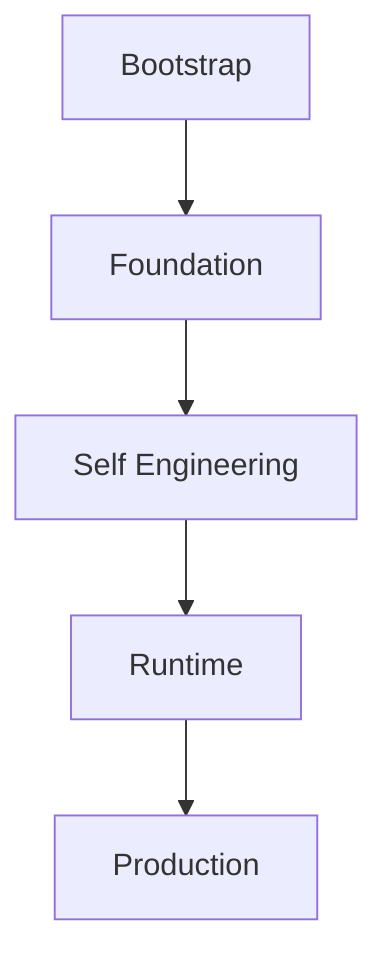
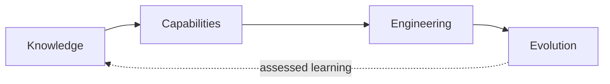

# Forge Roadmap

## Purpose and authority

This is Forge's canonical strategic roadmap captured from bootstrap knowledge.
It explains strategic evolution, architectural maturity, and long-term
destination without creating an implementation backlog, selecting delivery
order, or authorizing work. The [Forge Constitution](01_CONSTITUTION.md),
[Vision](02_VISION.md), [Core Architecture](03_ARCHITECTURE.md), [Engineering
Model](05_ENGINEERING_MODEL.md), [Knowledge Model](06_KNOWLEDGE_MODEL.md),
[Governance Model](07_GOVERNANCE.md), and [Capability Catalogue](09_CAPABILITIES.md)
remain authoritative for their respective boundaries.

## Roadmap philosophy

### Context

Forge needs a stable account of strategic evolution without treating a list of
possible features as an implementation plan.

### Current state

Bootstrap established a local, deterministic foundation and a capability-first
model. The canonical lifecycle distinguishes Roadmap, Backlog, Proposal,
Engineering Intent, Approval, Runtime Provider, Runtime Prompt, Execution,
Evidence, and Knowledge Evolution.

### Target state

The roadmap remains capability-driven: it frames the enduring direction in
which Forge can evolve, while individually bounded Capabilities make that
direction concrete. It is independent from Engineering Intents. A Roadmap may
inform an Intent, but an Engineering Intent is the canonical, model-independent
statement of one bounded engineering change and does not derive authority from
roadmap presence alone.

### Rationale

Separating strategic direction from bounded work preserves human governance and
prevents a roadmap from becoming either an implied approval or an execution
instruction. Engineering Intents implement Roadmap direction only when a
separately governed proposal and approval bound the work.

### Dependencies

This philosophy depends on the Constitution's human-governance,
repository-first, and capability-first principles; the Engineering Model's
Intent and evidence boundaries; and the Knowledge Model's reconciliation
boundary.

## Bootstrap path

### Context

Forge required an engineering environment before it could own its future
runtime. Bootstrap was therefore intentionally conducted through the temporary
Engineering Platform 1.5 Bootstrap Execution Host.

### Current state

Bootstrap preceded autonomous engineering so that Forge could first establish
its Workspace, knowledge, engineering, governance, and evidence boundaries in
repository-held form. The temporary host executed bounded Genesis transactions;
it did not become the owner of Forge knowledge, engineering meaning, or
governance.

### Target state

Forge can progress from its completed Foundation through Self Engineering and
later runtime maturity toward a governed Production state. The progression is
strategic rather than a delivery sequence.

### Rationale

Autonomous behavior without a durable product model would allow an execution
environment to define its own work. Bootstrap first established the durable
boundaries that let future execution remain governed, repository-first, and
provider-independent.

### Dependencies

The path depends on the temporary Bootstrap Execution Host boundary, durable
Engineering Intent, Runtime Provider abstraction, human approval, and
evidence-based phase completion.



`Self Hosting` was named in the bootstrap objective but is not established in
the captured Forge architecture as a phase, capability, or runtime commitment.
It is therefore not asserted by this roadmap; any future use requires its own
reconciled architectural evidence and governed Intent.

## Phase A — Foundation (complete)

### Context

Phase A was the bootstrap effort to create a small, deterministic engineering
foundation before Forge attempts to perform its own engineering through a
Forge-owned runtime.

### Current state

**Phase A is complete.** It established the Workspace and Foundation Model;
Knowledge source and consumption boundaries; Engineering planning, proposal,
Prompt Artifact, and Engineering Intent architecture; Governance boundaries;
Bootstrap Knowledge Packages; and the local, evidence-first foundation needed
to assess phase completion. The architectural outcome is a repository-first
model in which Workspace product meaning, canonical Intent, runtime-specific
translation, execution, governance, and evidence have separate authorities.

The completed state is local and deterministic. It provides schemas, immutable
models, loaders, registries, declarations, and typed evidence references. It
does not provide intent persistence, Runtime Providers, a Mission Runtime,
repository operation, execution, Studio, cloud service, or multi-user model.

### Target state

Foundation remains the durable base for subsequent capability evolution. Its
boundaries are preserved as Self Engineering acquires separately governed
capabilities; it is not replaced by provider prompts or a future execution
host.

### Rationale

Establishing Foundation first makes future engineering accountable to durable
knowledge and observable evidence instead of to a temporary bootstrap prompt
or runtime convention.

### Dependencies

Phase A relies on the Constitution, the Foundation Model, read-only knowledge
sources, repository evidence, and human governance. Future use of the
Foundation relies on preserving those same boundaries.

## Phase B — Self Engineering (underway)

### Context

Self Engineering is the established direction in which Forge turns its
repository-held engineering model into more durable, governed engineering
capabilities without giving execution authority to a runtime.

### Current state

Phase B is underway but incomplete. Its delivered Increment 1.0 is the
evidence-only Phase Completion Framework: it assesses declared criteria from
reproducible evidence and does not orchestrate work, operate repositories, or
grant execution authority. It does not establish Engineering Intent
persistence, migration, Runtime Providers, or execution.

Bootstrap has also established the following as directions or conceptual
boundaries, not implemented behavior: Engineering Intent lifecycle and durable
local persistence; reconstruction and migration of bootstrap intents;
Knowledge Reconciliation; Runtime Provider abstraction and derived Runtime
Prompts; Mission Runtime; and Architecture Stewardship. Repair reports exist
as evidence references; a separate `Repair Engineering` capability has not
been established by this capture.

### Target state

Self Engineering can mature through independently bounded capabilities that
persist and validate Intent, reconcile knowledge, derive runtime-specific
representations from canonical Intent, and assess evidence against declared
outcomes. It preserves Prompt Artifact compatibility until Runtime Providers
are separately implemented and governed.

### Rationale

The direction makes Forge progressively able to engineer itself while keeping
Intent canonical, runtime prompts derived and temporary, and human governance
outside execution.

### Dependencies

This phase depends on the completed Foundation, the Engineering Intent
architecture, the Phase Completion Framework, knowledge reconciliation,
repository truth, explicit human approval, and separately qualified
Capabilities.

## Capability evolution

### Context

Forge grows through bounded Capabilities rather than through an undifferentiated
product surface or an implicit runtime.

### Current state

Bootstrap defines a Capability as a declared, versioned, discoverable,
composable, independently evolvable unit. Present declarations do not imply
implementation, installation, approval, qualification, compatibility, or
production trust.

### Target state

Over time, Capabilities can become discoverable, versioned, qualified,
installable, and composable. Qualification remains evidence-first and
Production remains a future governed operating state rather than a phase made
real by documentation.

### Rationale

Capability evolution drives Forge evolution because it permits engineering
responsibilities to become useful independently while preserving explicit
dependencies, non-goals, and governance. It prevents names such as runtime or
Studio from silently becoming a monolithic product commitment.

### Dependencies

It depends on repository-held knowledge, explicit declarations, qualification
evidence, Governance, Workspace context, and compatible runtime and execution
boundaries where a Capability needs them.



## Knowledge evolution

### Context

Forge must preserve useful discoveries without allowing conversations,
transcripts, generated output, or provider prompts to become product truth.

### Current state

Bootstrap establishes the path from conversations and working material through
Knowledge Packages and reconciliation to repository knowledge. After review,
the repository—not its originating conversation or package—is canonical.

### Target state

The long-term knowledge direction is:

```text
Conversations
  ↓
Knowledge Packages
  ↓
Repository Knowledge
  ↓
Architecture Handbook
  ↓
Engineering Intents
  ↓
Engineering
```

Knowledge Distillation may make candidate discoveries reusable, while
Knowledge Reconciliation compares each candidate with Repository Context and
Architecture Stewardship guides coherent handbook evolution. Neither is an
automatic authority transfer or repository mutation.

### Rationale

Repository knowledge becomes canonical because it is reviewable against the
existing architectural baseline, can retain provenance and rationale, and can
be reconciled with repository reality. This makes the engineering loop durable
across conversations, providers, and execution hosts.

### Dependencies

It depends on versioned, read-only knowledge sources; Knowledge Candidates;
Repository Context; Architecture Review; Knowledge Packages; assessed evidence;
and human architectural judgment.

## Runtime evolution

### Context

Forge distinguishes the knowledge that defines engineering from the
environment that executes it.

### Current state

Engineering Platform 1.5 is only the temporary Bootstrap Host. Forge already
owns its conceptual engineering model, but its first operational runtime is a
future deterministic Forge CLI, not a Forge Runtime Service.

### Target state

The canonical implementation direction is CLI-first:

```text
Mission Document
  ↓
Mission Intake
  ↓
Forge CLI
  ↓
Mission qualification and canary
  ↓
Forge Runtime Service
  ↓
Forge Studio
```

The Runtime Service is an operational evolution of the validated CLI: it adds
continuous operation, supervision, automatic resume, evidence polling, and
scheduling without changing engineering behavior. Execution remains owned by
the Execution Host, and Engineering Platform 1.5 is reached only through the
Execution Host Contract and Bootstrap Execution Host Adapter.

### Rationale

Separating engineering knowledge from execution lets Forge retain its meaning
when providers and hosts change. It prevents temporary bootstrap transport and
execution availability from becoming permanent architectural authority.

### Dependencies

Runtime evolution depends on the CLI, Mission Intake, a Runtime Prompt Renderer,
the Bootstrap Execution Host Adapter, mission qualification, human approval,
repository truth, and evidence capture.

## Studio evolution

### Context

Bootstrap records a future Studio boundary but explicitly establishes no UI,
Studio, renderer, SaaS service, cloud runtime, or multi-user implementation.

### Current state

Studio remains deferred. `Electron Studio`, `Renderer Hosts`, and a
workspace-centric UX have been discussed as possible terms, but no captured
Forge architecture defines them as products, implementation details, or
roadmap commitments.

### Target state

A future Studio direction, if separately reconciled and governed, is the
primary user interface for the Business Workspace, Architecture Workspace,
Execution Workspace, and Analytics. It orchestrates the Runtime while
remaining independent of an execution host and never owning execution.

### Rationale

A user experience must not collapse Workspace ownership, canonical knowledge,
or governance into a provider-specific execution interface.

### Dependencies

Any Studio evolution depends on the Workspace model, runtime independence,
Governance, knowledge and capability boundaries, and a separately authorized
Capability. It has no established implementation dependency in bootstrap.

## Future evolution boundaries

### Context

Bootstrap identified several long-term directions beyond the current
Foundation without implementing or sequencing them.

### Current state

Forge Runtime, Knowledge Distillation, Architecture Handbook evolution,
Execution Host independence, expanded governance profiles, product identity,
and a Capability Marketplace direction appear as conceptual or deferred
boundaries. A Mission Runtime, queue, Studio, API, cloud, and multi-user
capabilities are explicitly deferred. No marketplace, multi-user governance
mechanics, cloud product, or execution system is currently established.

### Target state

Future evolution can make these directions independently useful only through
bounded, evidence-backed Capabilities. A Capability Marketplace could become a
future discoverability and composition direction, but this capture establishes
neither marketplace behavior nor installation mechanics. Multi-user governance
remains a future profile and governance boundary, not roles, access control,
or workflow implementation.

### Rationale

Recording strategic directions preserves bootstrap learning without converting
it into backlog work, a product promise, or a runtime commitment.

### Dependencies

Every future direction depends on the Foundation, repository-first knowledge,
explicit Capability boundaries, human governance, qualification evidence, and
a separately authorized Engineering Intent.

## Forge + Workspace V1 implementation programme (proposed)

This is the canonical detailed implementation sequence formerly held in
`docs/roadmap/0.1.md`. It does not approve a Mission, allocate a Mission ID, or
authorize execution. Each increment requires its own approved Mission and must
preserve the Forge/Workspace/EP ownership boundaries. The [V1 gap
register](../../docs/architecture/FORGE_WORKSPACE_V1_GAP_REGISTER.md) records
unresolved cross-product decisions.

### L0 — Engineering Contract Foundation

**Owner:** Engineering Platform. **Predecessor:** `P-TRANSPORT`.

Deliver capability classification, Effective DoR, pre-dispatch readiness,
Effective DoD, proof requirements, Human Gates, live/historical workflow
projection, completion enforcement, `ActionQualityOutcome`, packaged baseline
contracts and immutable Action snapshots. **Exit:** EP can enforce why an
Action is Ready and what makes it Done without source-repository access.

### L1 — Learning Evidence + New-Project Bootstrap Contract

**Owner:** Forge + EP contract boundary.

Define the versioned Action learning-evidence envelope and self-contained
bootstrap: installed baseline provenance, project-owned contract creation,
baseline/project/Action versioning, inclusion/redaction/privacy/retention and
clean-install behavior. **Exit:** a clean installation can create a
project-owned contract and expose terminal Action evidence without coupling
Forge to EP storage or source-authority repositories.

### L1-R — Managed Repository Governance Baseline

**Owner:** Forge, with repository-host adapters and EP/CI proof integration.
**Predecessor:** L1; complete before Installer/Release qualification.

Inventory mature repositories and classify settings as generic,
capability-dependent, organization/project-specific, workflow-required or
historical; never copy pcvantol settings blindly. Define a versioned generic
GitHub baseline covering protected/default branch, PR/review/conversation
policy, validation-derived required checks, security/CodeQL, trusted delivery,
ownership, merge/cleanup, workflow permissions, dependency updates,
rulesets and host limitations. Implement declarative desired state, idempotent
provisioning/reconciliation, read-back qualification and bounded evidence.
Existing repositories require inspect-and-propose adoption/drift handling, not
silent overwrite. **Exit:** `New Project → Managed → GitHub` proves
`REPOSITORY_GOVERNANCE = PASS` before general Ready without source authority.

### L2 — Quality Observer v1

**Owner:** Forge. Run lightweight post-Action analysis and persist traceable
DoR misses, DoD escapes, late failures, human rejection, repair, security,
documented-only requirements, manual checks and governance escapes. It makes
zero automatic governance mutations.

### L3 — Quality Learning Review + Hardening Proposals

**Owner:** Forge. Implement N-Action/milestone reviews, defect → root cause →
pattern → systemic hardening, requirement-to-enforcement audits,
`QualityLearningRecord`, repeated-defect detection and regression/mutation
proof proposals. Proposals may add, strengthen, merge, relax or retire
controls, including governance controls.

### L4 — Workspace Quality Governance

**Owner:** Workspace. Show DoR/DoD/Human Gates, governance status/drift and
Quality Learning Reviews; provide governed Accept/Modify/Reject and Managed
hardening Actions. This is a cross-product dependency marker, not a Forge
allocation or schedule of Workspace work: Workspace must accept, sequence and
qualify any corresponding capability in its own canonical roadmap.

### L5 — Knowledge Evidence Export Contract

**Owner:** Forge + EP + KB boundary. Define the redacted Action/source evidence
path to KB Engineering Observations with source identity, commit/version,
evidence-vs-interpretation separation and read-only source semantics. No KB
server/API is required.

### L6 — Knowledge Observer v1

**Owner:** Forge, preserving KB authority. Run lightweight post-Action
extraction and propose observations, implications, links, classifications,
relationships, duplicates, confidence and uncertainty. It never certifies or
promotes knowledge.

### L7 — Workspace Knowledge Governance

**Owner:** Workspace + KB governance integration. Present observations,
candidates, lineage, uncertainty, relationships and lifecycle state, with
governed review actions. This is a cross-product dependency marker, not a
Forge allocation or schedule of Workspace work: Workspace must accept,
sequence and qualify any corresponding capability in its own canonical
roadmap.

### L8 — Certified Knowledge Consumption in Forge

**Owner:** Forge + KB read-only consumer contract. Consume Certified Knowledge
in planning with lineage/rationale. It remains additive and never becomes
automatic project policy.

### L9 — Continuous Dual Learning Automation

**Owner:** Forge orchestration; Workspace governance; KB independent
authority. Automate observers, milestone/release reviews, repeated-defect
escalation, source/drift/gap triggers and bounded health/backlog projections.
Automation proposes/prepares; it never self-approves.

### L10 — Learning Effectiveness + Distribution Qualification

**Owner:** Forge + EP/CI + Installer/Release qualification. Measure
first-pass qualification, DoR misses, DoD escapes, human-review escape rate,
repeated defects and time-to-Done; use negative/mutation qualification and
qualify redundant-control retirement. **Exit:** clean machine, released
Forge/EP/Workspace, local baselines, new contract, qualified Managed GitHub
governance, enforced gates and no source-repository runtime dependency. Baseline
availability is air-gapped; GitHub provisioning uses only the selected user's
credentials/connectivity.

### Dependency, milestone and parallelism rules

```text
P-TRANSPORT → L0 → L1 → L1-R → Installer/Release qualification
Forge runtime/planning maturity → L2 → L3 → L4
KB integration readiness → L5 → L6 → L7 → L8
L2 + L6 stable → L9 → L10
```

Milestones are: **Executable Managed Engineering Contract** (L0/L1/L1-R),
**Project Quality Learner** (L2–L4), **Reusable Knowledge Learner** (L5–L8),
and **Continuous Learning Platform** (L9–L10). L5–L8 never block standalone
engineering execution. Only work that does not mutate a shared schema/API is
parallel-safe; each shared-contract predecessor must be reviewed and qualified
before dependents start.

Cross-product work not fully represented here—installation/named operator
(`G001`), multi-repository lease/coordination (`G005`), history/attention
recovery (`G007`), lifecycle retention (`G008/G009`), V1 security (`G011`) and
responsive Workspace UI (`G013`)—requires separately bounded dependencies
before a V1 implementation-ready claim.

Forge does not become a second execution engine. EP does not autonomously
rewrite project policy. Forge/EP/Workspace do not certify reusable knowledge.
KB does not mutate source repositories or become an execution dependency.
Product upgrades do not silently rewrite project/repository policy.

## Long-term vision

### Context

Forge's vision is an AI-native engineering platform that engineers products
under human governance, rather than a prompt manager or code generator.

### Current state

Forge is repository-first and local-first. It has captured the conceptual
model for knowledge, Capabilities, Intent, runtime independence, governance,
and evidence, but it does not yet execute engineering through Forge-owned
runtime capabilities.

### Target state

Forge ultimately aims to engineer itself; evolve through Capabilities;
maintain its own Architecture Handbook; distill engineering knowledge;
reconcile architecture continuously; and remain repository-first. The target
preserves human authority, explicit approval, and evidence-based assessment
rather than claiming autonomous self-authorization.

### Rationale

This destination closes the loop from durable knowledge to bounded engineering
and assessed evidence, so Forge can improve its product model without losing
architectural continuity as runtimes and execution hosts evolve.

### Dependencies

The destination depends on all preceding roadmap areas: the completed
Foundation, governed Self Engineering, Capability qualification, knowledge
reconciliation, runtime independence, repository truth, and human governance.
